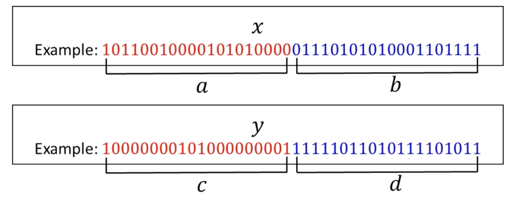

# Divide And Conquer

## Correctness
- Use induction to prove correctness of a recursive algorithm
- Assume all recursive calls are proven correct; prove that the n+1 call is correct

## Runtime (Recurrence Relations)

### Ex. Merge Sort
Let $T(n)$ be the worst-case runtime of Merge Sort on inputs of length $n$.

$T(n) \le T(\frac{n}{2}) + T(\frac{n}{2}) + \Theta(n)$
- $T(\frac{n}{2})$: the runtime of the recursive call on the left half
- $T(\frac{n}{2})$: the runtime of the recursive call on the right half
- $\Theta(n)$: the runtime of merging the sorted arrays

Since $\Theta(n)$ is re-writable as $c * n$ for some large enough constant $c$, we can rewrite as:

$T(n) \le 2T(\frac{n}{2}) + cn$

For each layer number $i$, there are $2^i$ nodes, and each node contributes $c\frac{n}{2i}$ work. Thus, when you're $i$ layers deep, the total work is $c\frac{n}{2i} * 2^i = cn$ for that layer.

There are $O\left(\log\left(n\right)\right)$ layers, so the total work is $cn*log(n)$ which is $O\left(n\log\left(n\right)\right)$.

### Ex. Multiplication of large numbers


**Algorithm**
- Split _x_ into two halves, _a_ and _b_
- Spliy _y_ into two halves, _c_ and _d_
- Observe that $x = 2^\frac{n}{2}a + b$ and $y = 2^\frac{n}{2}c + d$
    - $2^\frac{n}{2}a$ is the same as `a << n/2`, i.e. pad _a_ with zeroes and add _b_ 
- By FOILing, $$x * y =\\ (2^\frac{n}{2}a + b)(2^\frac{n}{2}c + d)=\\ 2^nac + 2^\frac{n}{2}(ad + bc) + bd$$

**Operations**
- To compute `ac`, `ad`, `bc`, and `bd`, we call multiply recursively 4 times
- We need to do 3 n-bit additions (assume $O(n)$)
- We need to do 2 bit shifts (multiply by $2^n$ and $2^\frac{n}{2}$) (Assume $O(n)$)

**Recurrence relation**
$$
T(n) \le 4*T(\frac{n}{2}) + O(n)\\
T(n) \le 4*T(\frac{n}{2}) + cn
$$

- The input size at layer _i_ is $\frac{n}{2^i}$
- The number of "nodes" in layer _i_ is $4^i$
- The work done at layer _i$ is $c\frac{n}{2^i} * 4^i = cn$
- Summing over all the layers, we need $$\sum_{i=0}^{\log_{2}(n)}4^{i}\left(\frac{cn}{2^{i}}\right)=\sum_{i=0}^{\log_{2}(n)}2^{i}cn=cn\cdot\sum_{i=0}^{\log_{2}(n)}2^{i}$$
- Remember that $\sum_{i=0}^{k}2^{i} = 2^{k+1} - 1$
- We end up $cn * \Theta(n) = \Theta(n^2)$, which is no better than the naive algorithm (multiplying like you do in elementary school)

### Ex. Multiplication of large numbers by Karatsuba's Algorithm
- Karatsuba's algorithm is an improvement over the naive recursive algorithm
- If we can somehow compute the inner $(ad + bc)$ in one step rather than two, we can get the number of recursive calls down to 3
- Notice that $(a + b)(c + d) = ac + bd + (ad + bc)$; ergo, if we compute $(a + b)(c + d)$ and we subtract $ac + bd$ (both of which we already know), we can get $(ad + bc)$

```
Mult
Input: two n-bit integers x, y
Output: x * y

Let a,b,c,d be described as above

m1 <- Mult(a, c)
m2 <- Mult(b, d)
m3 <- Mult(a + b, c + d)

return 2^n * m1 + 2^(n/2) * (m3 - m1 - m2) + m2
```

**Recurrence relation**
- Same work as above, but replace 4 with 3
$$
\sum_{i=0}^{\log_{2}(n)}3^{i}\left(\frac{cn}{2^{i}}\right)=\sum_{i=0}^{\log_{2}(n)}\left(\frac{3}{2}\right)^{i}cn=cn\cdot\sum_{i=0}^{\log_{2}(n)}\left(\frac{3}{2}\right)^{i}
$$
- Use the following theorem about geometric series:

> When summing terms which are growing exponentially, the sum is dominated by the **largest** term in the sum.
> $$a^0 + a^1 + a^2 + \ldots + a^k = \Theta(a^k)$$

- Thus, our recurrence relation:

$$
= cn\cdot\Theta\left(\left(\frac{3}{2}\right)^{\log_2(n)}\right)\\
= cn\cdot\Theta\left(\frac{3^{log_2(n)}}{2^{log_2(n)}}\right)\\
= cn\cdot\Theta\left(\frac{3^{log_2(n)}}{n}\right)\\
=\Theta(3^{log_2(n)})\\
= \Theta(3^{log_2(n)})
$$

- Let's change the base

> What is $3^{log_2(n)}$?
> $$
> 3 = 2^{log_2(3)}\\
> 3^{\log_2(n)} = \left(2^{\log_2(3)}\right)^{\log_2(n)} = 2^{\log_2(3)\log_2(n)}\\
> = \left(2^{\log_2(n)}\right)^{\log_2(3)}\\
> = n^{\log_2(3)} \approx n^{1.585}

So our runtime is $\Theta(n^{1.585})$. This is better than $O(n^2)$.

## The Master Theorem
- A typical divide and conquer runtime looks like $$T(n) \le a\cdot T\left(\frac{n}{b}\right) + c\cdot n^d$$

**Case 1: Merge Sort case**
- Total work per layer _stays the same_
- Result: [# of layers] × [work per layer]

**Case 2: Karatsuba case**
- Total work per layer increases exponentially
- Result: simply the work in the bottom layer

**Case 3: Decreasing work**
- Total work per layer decreases exponentially
- Result: simply the work in the top layer
