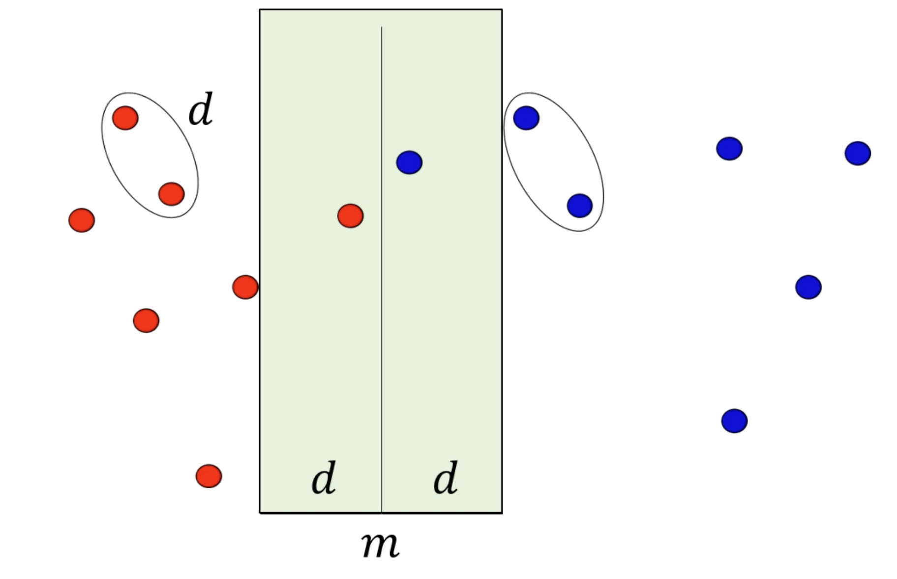
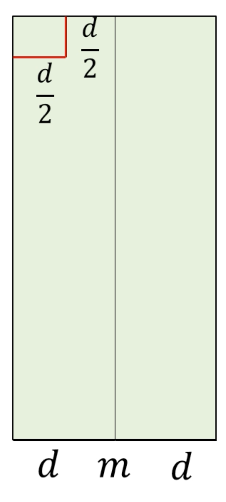
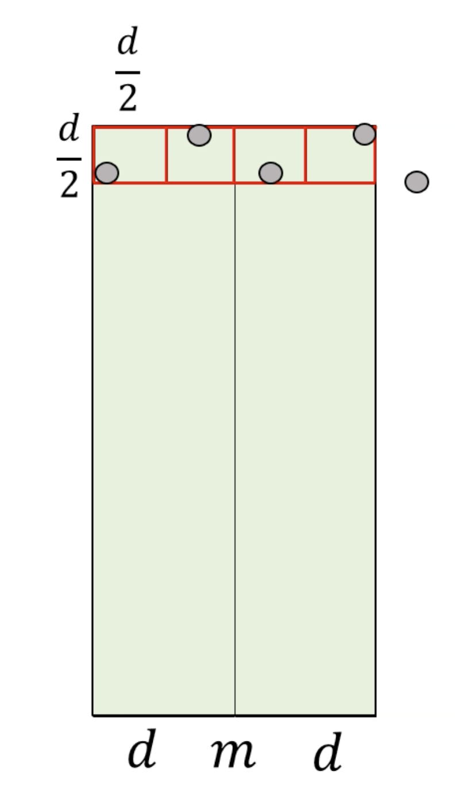

# More Divide And Conquer

## Counting inversions
> - The number of inversions in a list is the number of pairs of elements that are out of order
> - i.e. a pair of indices (i, j) is an inversion if `A[i] > A[j]` but `i < j`
> Find the number of inversions in a list _A_.

- Make an algorithm similar to merge sort
- At each merge:
    - Count # of inversions in left half
    - Count # of inversions in right half
    - Count crossing inversions: inversions across the two halves
- If the left and right halves are sorted, counting crossing inversions is much easier
    = One pointer for left half, one pointer for right half
- So, we can run merge sort, but count inversions while we merge (no additional runtime overhead)

```
// Returns: Sort(A), Inv(A)
Sort-And-Inv(A[1, ..., n]):
    L, iL <- Sort-And-Inv(A[1, ..., n/2])
    R, iR <- Sort-And-Inv(A[n/2 + 1, ..., n])
    C, iC <- Merge-And-Inv(L, R)

    return C, iL + iR + iC
```

## Closest Two Points
> - Given a list _A_ of 2D points, output the closest pair of distinct points in _A_.
> - Assume you can compute the distance of two points in $O(1)$ time.

- Sort the list of points by _x_ value.
- Split down the middle (by the median _x_ value).
- Compare the closest pair on the left, and the closest pair on the right.
- Check if any of the points that cross the dividing line are closer than the two pairs on either side

### Checking crossing points
- If the closest pair on either side is _d_ units apart, then the closest pair across the dividing line must be at most _d_ units apart. So, we only check points within _d_ of the dividing line



- If we draw a $\frac{d}{2} \times \frac{d}{2}$ box, it's guaranteed that only one point is in that box
    - Two points in the square are at most distance $\frac{\sqrt{2}}{2}d$ apart (diagonal)
    - $\frac{\sqrt{2}}{2}d \le d$, so if two points were in the box, _d_ would have been smaller



- By the pigeonhole principle, in one row, you can only fit 4 points in one row



- If two points have less than 2 rows between them, they can't be closer than _d_ units.
- This means we can restrict our search to the next 11 boxes.
- Getting the list sorted in row-order is as simple as sorting the list by _y_ value


