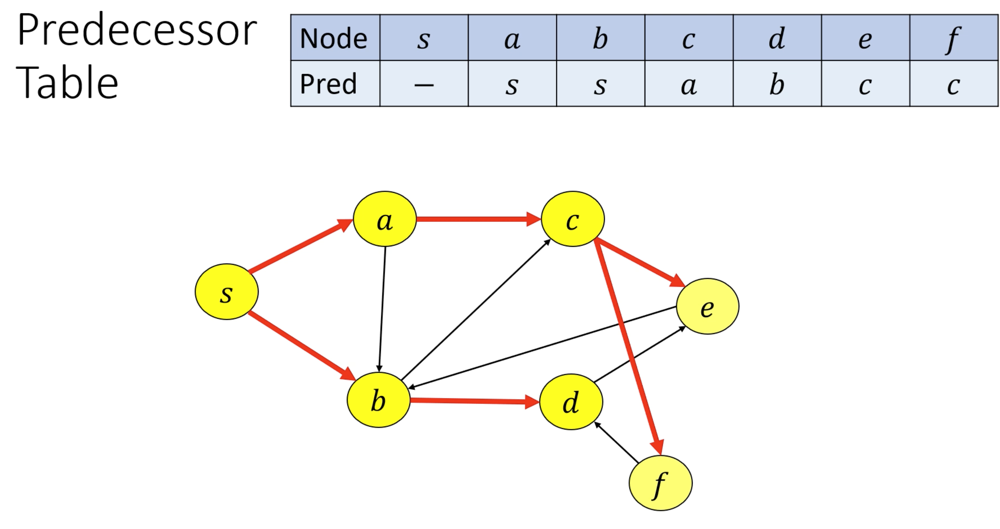
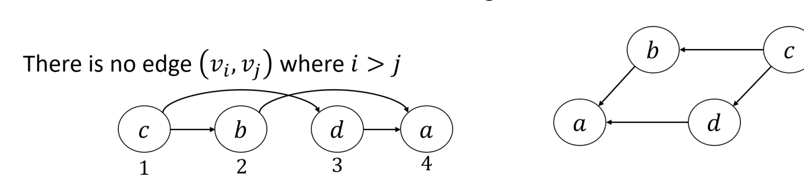

# Graph Algorithms

## Graph Definitions
- **Walk**: a list of vertices where each vertex is connected to the previous by an edge
- **Path**: a walk with no repeated vertices
- **Closed walk**: if you take at least one step, and the starting vertex is the same as the ending vertex
- **Cycle**: a closed walk with no repeated vertices (except for the starting one)

## Notation
- $n$: # vertices
- $m$: # edges

## Graph Storage
There are many ways to store a graph in memory
- **Adjacency matrix**
- **Adjacency list**: for each vertex, have a list of its neighbors

## Generic Graph Search
- Pick a node _s_, mark _s_ as "visited"
- While there is an edge $(u, v)$ from **visited** _u_ to **unvisited** _v_, mark _v_ as "visited"
- While there is an unvisited node that can be visited, visit it

### Proof of Correctness
- _If vertex $v$ is marked reachable, there is a path to $v$_
    - Through the inductive hypothesis, assume all nodes reachable have a path to them
    - When _v_ is marked visited, it's because there is an edge $(u, v)$ from a visited node _u_
    - Since _u_ is already marked visited, _u_ must be reachable
    - _v_ is therefore reachable by using some path to _u_, and one more step $(u, v)$
- _If we can reach **v**, then it gets marked reachable_
    - Assume _v_ is not marked visited
    - By the "well-ordered principle," there is some **first** node _u_ in the path to _v_ that is unvisited
    - Using this assumption, we can say that a node _t_ directly before _u_ has been visited (because _u_ is the first unvisited)
    - But, the edge $(t, u)$ exists! Contradiction.

## Breadth-First Search
- Choose start node _s_
- Mark _s_ as reachable and add _s_ to a queue _Q_
- Until _Q_ is empty, remove and explore front element of _Q_
- To "explore" a vertex _v_, mark each of its unmarked neighbors and add them to _Q_

### Correctness

#### Invariant: The algorithm visits all ndoes with $d=0$, then $d=1$, then $d=2$... i.e. in order of distance

**Base case**: We visit all nodes with $d=0$ first (since there is only one node with distance 0)

**Inductive step**: Assume BFS marks all nodes $d=0$, then $d=1$, $\cdots$ $d=k$. Prove that BFS will mark all nodes $d=k+1$ before remaining nodes

For node _v_ with $d=k+1$, we have a predecessor _u_ with $d=k$. This node gets marked.
- If _u_ instead had a distance less than _k_, then we should be able to find a shorter path to _v_ and _v_ would have a dist ance less than $k-1$.
- If _u_ instead had a distance greater than _k_, then _v_ has a distance more than $k+1$.

Now, let's Also prove that we aren't marking any nodes with distance $d \gt k+1$ before all nodes $d=k$ are removed.
- The distance to _u_ is $d \le k$. So, the distance to any node _v_ we mark is $d \le k+1$.

### Runtime
- While we could do a naive runtime analysis by checking the loop, we can do better by totaling the work done over all iterations
- The work in one iteration of the loop is `[# edges checked] * O(1) + O(1)`
- We only check each edge once!
- We have $o(m)$ total work, across all visits
- However, the work from setting up the table of visited elements, and popping vertices out of the queue, is $O(n)$
- So, our total runtime is $O(n + m)$

### Returning The Shortest Path (Predecessor Table)
- It would take $O(n^2)$ time to write down a list of vertices on the shortest path to each node
- So, we can use a **predecessor table** instead
- A node _v_'s entry on the predecessor table is its previous node on the shortest path


## Depth-First Search
- BFS but replace queue with a stack

### Topological Ordering
- Given a **directed acyclic graph** (DAG). a **topological ordering** is a li st $v_1, \cdots, v_n$ such that are no "back-edges", i.e. $\neg \exists (v_i, v_j)$ where $i \gt j$
    - i.e. put all nodes in a list, all edges should point forwards

- Example: courses and their prerequisites

#### Lemma: Every DAG has a "source node" with no in-edges
- **Source**: node with no edges pointing into it
- **Sink**: node with no edges pointing out of it
- In a DAG, there is at least one source and one sink

#### Lemma: Every DAG has a topological ordering

Proof by algorithm
- While there is a source node, remove it, and add it to the list. That list is your topological ordering
- Our algorithm always terminates because every DAG has a source node, and removing a node will not suddenly introduce a cycle. So the algorithm always terminates
- Thus, since we have a valid algorithm to construct a topological ordering, it must exist

#### Implementation
```
Rec_DFS(u):
    Mark[u] = true
    
    For each neighbor v of u:
        if Mark[u] == false:
            Rec_DFS(v)
    
    FinishTime[u] = counter
    counter++
```
- If `FinishTime[u] < FinishTime[v]`, then there is no edge from _u_ to _v_
    - Case 1: if `Rec_DFS` is called on _v_ first, since there is no edge from _v_ to _u_, _v_ finishes first
    - Case 2: if `Rec_DFS` is called on _u_ first, then _u_ calls _v_ and _v_ finishes first
- Thus, you can make a list of vertices indexed by finish time, and that is a topological ordering
