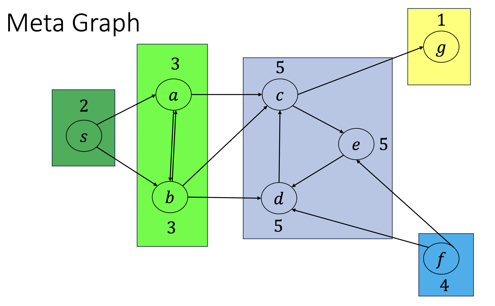

# Connected Components
- Each vertex in a directed graph belongs to exactly one **strongly connected component**
- The SCC $C_u$ of vertex $u$ is the set of vertices which _can reach_ and _can be reached_ by $u$
    - $C_u = \{ v \in V \mid u \overset{\rightarrow}{G} v \text{ and } v \overset{\rightarrow}{G} u \}$

## Meta Graph
- You can construct a "meta graph" where each vertex is a SCC

- Note that the meta graph is also a DAG
    - If $C_u$ can reach $C_v$, then every vertex in $C_u$ can reach every vertex in $C_v$
- Finish times: If $C_u$ has an edge to $C_v$, all vertices in $C_v$ will "finish" before every vertex in $C_u$ is finished
    - To prove this, induct with base case of sink components
- The above "finish times" lemma can help us find the SCCs of a DAG
    - Generate a graph with the direction of its edges reversed
    - Run DFS to get finish times for all nodes
    - Find the **sink** component by searching G from last node in finish-time order
    - Then, for each node ordered by finish-time order, BFS to find its component
