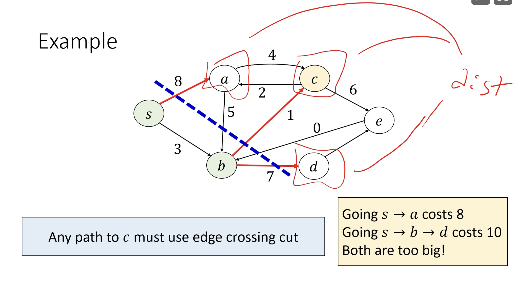

# Weighted Graphs

## Nonnegative Weighted Shortest Path Search (Dijkstra's)
- Keep a set of "solved" vertices and "unsolved" vertices
- Until all vertices are solved, pick the shortest path to see an "unsolved" vertex and declare it "solved" (_greedy algorithm_)
    - When a vertex is "solved," its current distance counter is guaranteed to be the actual distance

1. Mark starting node as solved and distance 0; mark all other vertice with infinite distance
2. For the current vertex $v$, set each of $v$'s neighbors to have $v$'s distance + the edge's weight
3. Mark the unsolved node with the lowest distance as solved; visit it as the current node

```
Input: a graph G = (V, E) with weights w and a source node s

function Dijkstras(G, w, s):
    Initialize Distance table
    Initialize IsSolved table
    Initialize Predecessor table

    for i = 0 to n:
        Find unsolved vertex u with min distance value
        Mark u as solved

        for every vertex v such that (u, v) ∈ E:
            if dist(u) + w(u, v) < dist(v):
                set new distance and predecessor for v
```

### Runtime
- Naive runtime: $O(n^2)$
- If we use cool data structures, we can improve this runtime to $O\left((n + m) \log{n}\right)$
#### Sparse Graphs
- We can improve the runtime if we assume the graph is sparse to $O\left((n+m) \log{n}\right)$
    - EDIT: maybe this is if you use a heap, and not only for sparse graphs? verify
- if the graph is sparse, we can assume looping through the edges is $O(1)$

### Correctness
- Paths never get shorter: you can't improve distance by taking a longer path, since no negative edge weights
    - Also, taking a cycle will only increase your distance
- Our assumption that the node with the min distance value is solved
    - We can imagine a "cut" that divides solved from unsolved vertices
    - The distances of unsolved vertices denote the cost to cross the cut using that edge
    - Each path crossing the cut has length _at least_ `dist(u) + w(u, v)`; this is the minimum possible distance to any unsolved vertex
    - And, there _is_ a path to _v_ of length `dist(u) + w(u, v)`, so this path must be the shortest


