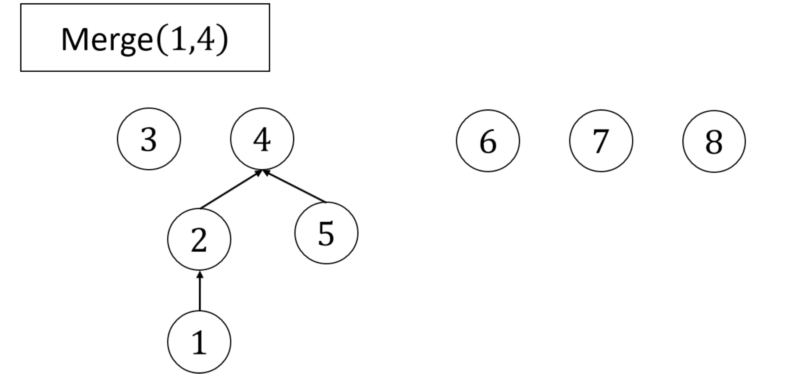

# Minimum Weight Spanning Tree
- We have a greedy algorithm for finding the Minimum Weight Spanning Tree of a connected, undirected graph

## Theorem About Trees
All trees have the following properties:
1. Connected
2. Acyclic
3. If has $n$ nodes, has $n-1$ edges

A graph is a tree if it has _any two_ of these properties.

## Kruskal's Algorithm to find the Minimum Weight Spanning Tree
While not all nodes are connected:
- Grab the edge with the smallest weight that DOESN'T create a cycle

### Feasibility: Algorithm Produces a Tree
- Property 2 satisfied because we never add an edge that creates a cycle
- Property 1 satisfied (assuming our original graph was connected)
    - Suppose there were two components (no edge from component 1 to component 2)
    - Our algorithm considered the edge that connects component 1 to component 2, and it would not create a cycle, so we would've added it!

### Optimality: Output Tree has Minimum Weight
**Premise**
- Greedy stays ahead
- Our Kruskal's solution is edges $T = \left(e_1, \dots, e_{n-1}\right)$ sorted by weight
- We consider an alternative spanning tree $T' = \left(f_1, \dots, f_{n-1}\right)$ sorted by weight
- We will prove that for all _i_, $w(e_i) \le w(f_i)$
- i.e. item-by-item, Kruskal's will always have a smaller weight (which is a much stronger statment than, and implies, that Kruskal's is better)

**Prerequisites**
- If $E_1$ And $E_2$ are both acyclic, and $E_1$ has less edges than $E_2$, then there is some edge in $E_2$ that you can add to $E_1$ that still won't make $E_1$ cyclic
    - Lemma from PSET 7

**Contradiction**
- Suppose that there is some $k$ where $w(e_k) > w(f_k)$
- Consider $\{e_1, \dots, e_{k-1}\}$ and $\{f_1, \dots, f_k\}$
- By our lemma, we can steal one of the $f$ edges and put it into $T'$, such that it won't make a cycle
    - i.e. there is some $f_i \in \{f_1, \dots, f_k\} \setminus \{e_1, \dots, e_{k-1}\}$ such that $\{e_1, \dots, e_{k-1}, f_i\}$ is still a tree
- The next edge we would have added is $e_k$, and by our assumption, $w(f_i) \lt w(e_k)$
- And, we know $w(f_1) \le w(f_k)$, so $w(f_i) \lt w(e_k)$
- But if this is true, we would have considered $f_i$ in our algorithm and added it before $e_k$, which is a contradiction

### Runtime
- Sorting takes $O(m \log{m})$
- Checking whether each edge creates a cycle is $O(m
 \cdot n)$
    - Number of edges in tree is $n-1$, so each BFS to find cycle takes $O(n)$ 

### Optimization
- If we keep track of connected components, we can speed up checking if an edge would make a cycle (by checking if they're in the same component)
- Every time we add an edge, we merge the two components

**Union-Find**
- We can do this quickly with a Union-Find datastructure
    - Start with a set of all vertices
    - To merge, point one vertex to the other
    - To merge two larger components, point the root of one to the root of the other
        - The new parent should be the root with the larger height
    - To check if two vertices are in the same component, check if they have the same root
    

**Runtime**
- Inserting a node in Union-Find is $O(\log n)$
    - Due to our "new parent is taller" rule
- Reporting the root node of a component is $O(\log n)$
- Total runtime for Kruskal's is now $O(m \log n)$

## Prim's Algorithm to find the Minimum Weight Spanning Tree
- Start with a random first vertex
- While the tree is not complete, pick the vertex that's ouside of the tree with the minimum weight from the tree

### Feasibility
- Tree is connected and is spanning, because we only stop when we have added all vertices not in the tree
- Tree is acyclic because we only add edges to vertices that aren't in the tree

### Optimality
- We will first argue that all edge weights are unique.

**The Cut Property**
- Use a Greedy Exchange lemma
- For every cut $(S, V \setminus S)$, if there is a unique lightest edge $e$ crossing the cut, then $e$ is in _every_ MST of G
- We can imagine our "cut" is between all nodes in the tree, and all nodes not yet in the tree
- So, the lightest edge from the tree (i.e. the edge to the closest vertex) is in every MST
- This means that the MST we find is the _only_ valid MST

**Proof of the Cut Property**
- Suppose there is an MST $T$ that does _not_ contain $e$, the lightest edge that crosses a cut
- There is some edge $c_1, \dots, $c_k$ that crosses the cut that is _not_ $e$

- We can replace $c_1$ with $e$ and get a lighter tree
    - $T \cup \{e\}$ has a cycle
    - The path from $u$ to $v$ (the endpoints of $e$) must use some cut edge $c_i$
    - When we delete (only) $c_i$, we now have exactly two connected components. But, when we add $e$, they get merged back together, and the spanning tree becomes lighter.

**Dealing with equal edge weights**
- If two edges have equal weight, subtract a very small $\epsilon$ and find the MWST
- When we remove the cheating $\epsilon$, the weight of our real MWST will be greater than the weight of our cheating tree
- If $\epsilon$ is small enough, the difference will reduce to zero, and the two trees will have the same weight

**Runtime**
- Prim's algorithm is exactly the same as Dijkstra's algorithm, but we don't keep track of weights
- So runtime is $O(m \log{n})$ or $O(n^2)$ (depending on algorithm; choose best depending on how dense the graph is)
