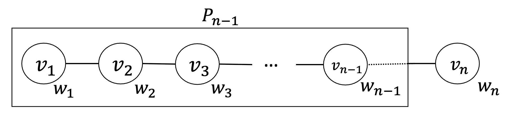
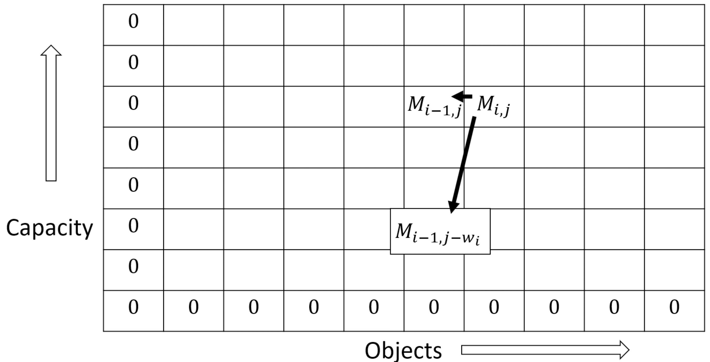
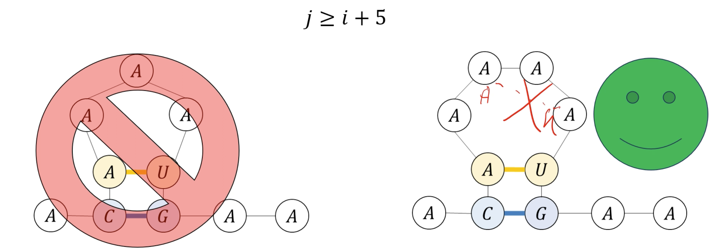
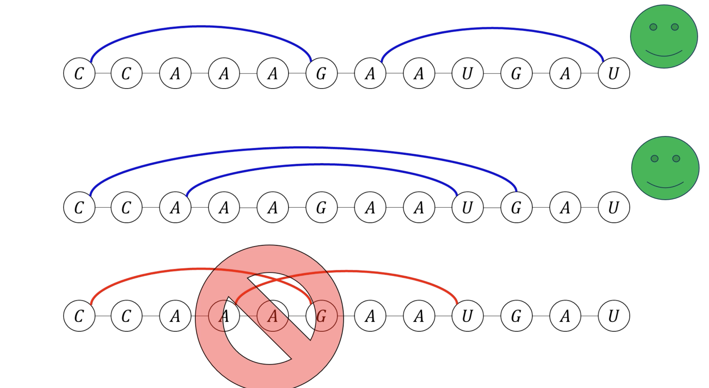
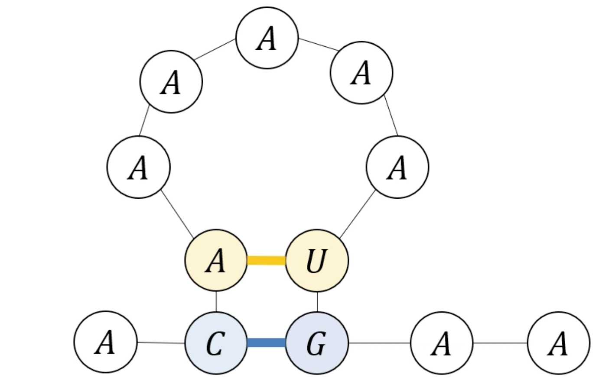
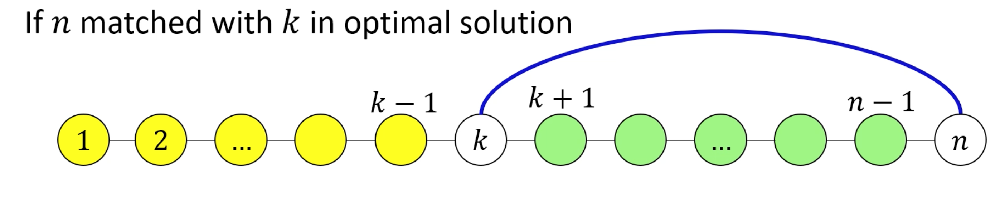

# Dynamic Programming
- Dynamic programming is a method allowing us to compute a solution based on smaller solutions, which are memoized and/or "table-filled".

## Example: Fibonacci
We can find the _n_'th fibonacci number with the following recursive formula:
$$
Fib(n) = Fib(n-1) + Fib(n-2)
$$
However, note that we are re-computing the same value more than once. We can instead *memoize* each computed value so we only have to compute it once.

We can keep an array of computed values $1 \dots n$, and fill in the table when a value is computed; every time, we look up in the table and see if it's already there.

With this new approach, we can even get rid of the recursion and use an iterative approach ("table filling" instead of memoization).

```
Fib(n):
    Initialize table Memo[0, ..., n]
    Memo[0] = 1
    Memo[1] = 1
    for i = 2 to n:
        Memo[i] = Memo[i-1] + Memo[i-2]

    return Memo[n]
```

## Example: Maximum Weight Path Graph Independent Set
- Given a path graph, where each vertex has a weight:
- Find the independent set with the maximum weight (i.e. you can't choose two vertices that touch)

### DP solution
- For vertex $v_n$, either the solution includes it, or doesn't include it.
    - If the solution includes it, then we can include $v_n$, and use the solution for $n-2$ (since $n-1$ isn't allowed because then they would touch)
    - If the solution doesn't include it, then the solution is the same as the solution for $n-1$


### Algorithm for computing weight
$$
M_n = max(M_{n-1}, M_{n-2} + w_n)
$$

- Base case: $M_0 = 0$, $M_1 = max(w_1, 0)$ (in case of negative weight)

## Weighted Interval Scheduling
For a set of time intervals, where each has a weight/payoff, find the set of non-overlapping intervals that maximizes the total weight of the set.

### DP Solution
> Similar to Max Weight Path Graph Independent Set
- Sort the intervals by finish time
- We compute the solution for if each interval is in the optimal solution, or if it is not
    - If interval `i` is in the optimal solution, throw out everything that conflicts with `i`.
    - If interval `i` is not in the optimal solution, use the solution on the input set without it.
- Finding intervals that conflicts:
    - Let `F[k]` be the interval with the _lastest finish time_ which finishes before `F{n}` starts.
    - $F[k+1, \dots, n-1]$  is exactly all intervals conflicting with `F[n]`

**Table filling implementation**
```
function WeightedIntervals():
    Initialize table M[0, ..., n]
    M[0] = 0

    Let F be a list of intervals sorted by finish time

    For i = 1 to n:
        Find latest index k such that F[k] ends before F[i] starts, using binary search
        M[i] = max(M[i - 1], M[k] + F[i].weight)
    
    return M[n]
```

Runtime: $O(n\log{n})$

## Knapsack Problem
For a list of items, each with a weight and a value: return the list of items to carry to maximize value, if you can carry a given max weight.

i.e. for $w_1, \dots, w_n$ and $v_1, \dots, v_n$, output a set $S \subseteq \{1, \dots, n\}$ such that $\sum_{i \in S}{w_i} \le C$, maximizing $\sum_{i \in S}{v_i}$

For this problem, we have two parameters to control: remaining capacity, and remaining number of objects.

- If optimal solution doesn't use object $n$:
    - $M_{n,C} = M_{n-1,C}$
- If optimal solution uses object $n$:
    - $M_{n,C} = M_{n-1,C-w_n} + v_n$



This algorithm runs in $O(n \times C)$; it is linear for the _value_ of the input, but exponential for the _length_ (order of magnitude) of the input

## RNA Sequence Alignment Problem
- Given a list of bases (`A`, `C`, `G`, and `U`)
- The list can roll up and stick to itself
    1. Each base can only match with one other base
    2. `A` sticks to `U`; `C` sticks to `G`
    3. No sharp turns: if $i \lt j$ and $i$ matches $j$, then $j \ge i+5$
    
    4. Non-crossing: if $(i, j)$ and $(k, l)$ are pairs where $i \lt j$ and $k \lt l$, we can't have $i \lt k \lt j \lt l$
    
- We want to find the structure with the most bases stuck together
- Return a list of base pairings




### DP Solution
- For each base, either base `n` is matched or not
- If base `n` is not matched:
    - We find the optimal solution for $1, \dots, n-1$ (tacking on an additional base to an optimal structure doesn't break any rules)
- If base `n` is amtched with element `k`:
    - To not break the no crossing rule, we have essentially partitioned our solution into two halves
    - The remaining solution is comprised of the optimum of $1, \dots, k-1$ and $k+1, \dots, n-1$

**Recurrence**
- Let $M_{i,j}$ be the maximum number of matching for bases $i, i+1, \dots, j$
- If $j$ is matched with $k$ in the optimal solution,
$$
M_{i,j} = M_{i,k-1} + M_{k+1,j-1} + 1
$$
- So to find optimal $k$, we can take the max
$$
M_{i,j} = \max_k(M_{i,k-1} + M_{k+1,j-1}) + 1\\
k \in \{i, i+1, \dots, j-5\}
$$
- Now, we consider both the case that $j$ is matched, and the case that $j$ is unmatched
$$
M_{i,j} = \max\left(M_{i, j-1}, \max_k\left(M_{i,k-1} + M_{k+1,j-1}\right) + 1\right)
$$

**Base cases**
- $M_{i,j} = 0$ whenever $j \le i+4$
