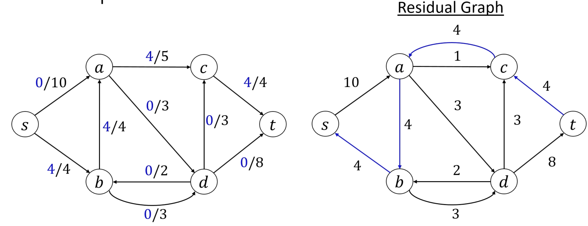
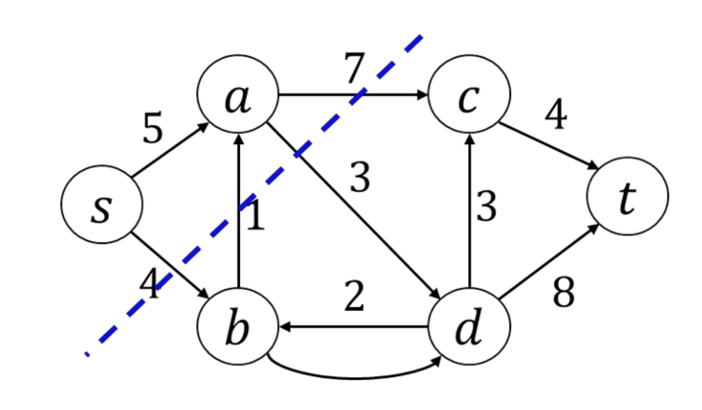
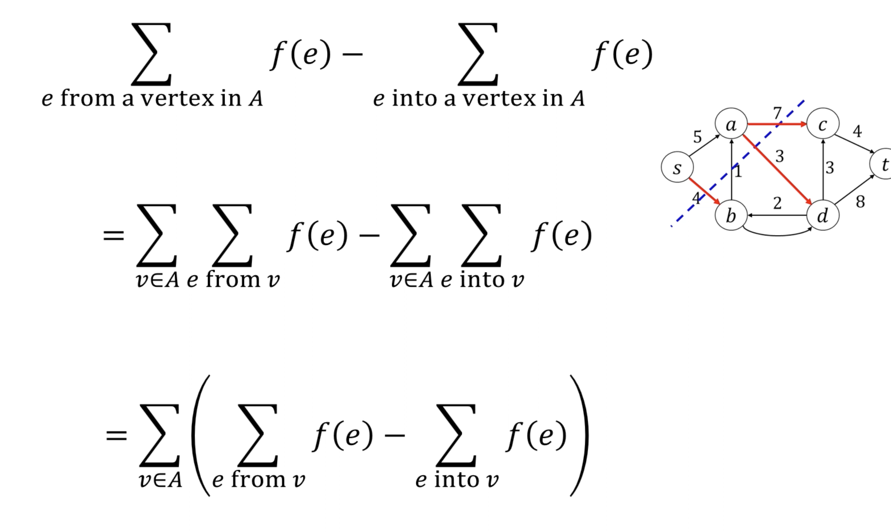
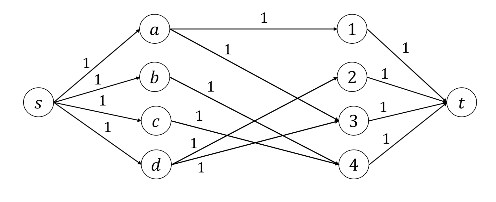

# Flow Networks

## Properties of flow networks
- Directed (but not necessarily acyclic) graph
- Dedicated source node
- Dedicated sink node
- Edge weights represent "flow capacity", i.e. perhaps the cross-sectional area of a pipe
    - Edge weights are always non-negative

## Flows
- A flow is an assignment of values $f(e)$ to each edge, such that
    - Flow is non-negative
    - Flow is less than the capacity of each edge
    - Conserved: for all nodes except for the source and the sink, the egress is equal to the ingress

## Bottlenecks
- Take, for example, all edges out of the source. The max flow is necessarily restricted by the sum of those edge weights
- Same with all edges into the sink

## "Black Boxes"
- Just like nodes have to have equal ingress and egress, any collection of nodes ("black box") also has to be conservative
- We can use this intuition to prove that the flow out of _source_ is equal to the flow into _sink_

## Augmenting Paths
- An augmenting path is a path from source to sink, in which every edge's flow can be increased
- We can also consider augmenting paths that use edges _in reverse_
    - Upon a backwards edge, you _remove_ flow instead of _adding_ flow
- An augmenting path exists if and only if you have not achieved max flow

## Ford-Fulkerson Algorithm
Find augmenting paths and augment... until you can't!

### Residual Graphs
- An edge $(u, v)$ exists on the residual graph iff flow can be added or removed from $u$ to $v$
- Draw fowards edges when there is excess capacity (flow exceeds capacity)
    - Capacity on residual graph for forward edges is `(capacity - flow)` of original graph
- Draw backwards edges for all edges with nonzero flow (i.e. you are able to remove _some_ amount of flow)
    - Capacity on residual graph for backedges is just the flow on the original graph
- If there is a forwards edge _and_ a backwards edge, just take the difference of the values

### Finding Augmenting Paths
- Do a BFS/DFS on the residual graph until you can't find a path from source to sink anymore!

### Definition: `s-t` Cuts and Cut Capacity
- An s-t cut is a cut (partitioning vertices into two sets), where the sink is in one half, and the source is in the other

- The capacity of an s-t cut, $(A, B)$, is $$C(A, B) = \sum_{u \in A, v \in B}{c(u, v)}$$ i.e. the total capacity of edges that cross from A to B (not from B to A!)
- Therefore, s-t cuts Are _bottlenecks_, and impose an upper bound on total flow

### Cut Flow Lemma
- For any s-t cut $(A, B)$, the flow that makes it from _s_ to _t_ is the flow that leaves A and doesn't come back

### Optimality of Ford-Fulkerson
If we prove that there's a cut that has the capacity of the final flow value, then we have proved that the flow is optimal

**Valid augmenting cut**
- At the end of Ford-Fulkerson, the residual graph has A set of vertices $A$ reachable from source _s_, and a set of vertices $B$ unreachale from _s_.
- sink _t_ is necessaily in $B$, since there are no augmenting paths.
- Therefore, $(A, B)$ is a valid augmenting cut.

Next, we will argue that the cut has the capacity of the final flow value.

- Every edge from $A$ to $B$ in the original network is at capacity
    - All the edges leaving $A$ are full, otherwise there would be an edge in the residual graph, and the cut wouldn't separate reachable from unreachable.
- There is no edge from $B$ to $A$ that has any flow
    - Otherwise there would be back-edges, and the cut wouldn't separate reachable from unreachable.

### Runtime of Ford-Fulkerson
$O(m \times \lvert f \rvert)$

i.e. [number of edges] * [max flow]

## Max-Flow Reducible Problems
### Finding Min Cuts
- We proved that the flow is equal to the capacity of any s-t cut. So, if we can find the max flow, we can find the capacity of the min-cut.
- To find the min-cut, find the max flow and residual graph, and take the cut between reachable and unreachable vertices.
    - i.e. the min-cut problem is reducible to a max-flow problem.
- Finding a min-cut is useful to identify bottlenecks in a network

### Maximum Bipartite Matchings
- A matching is a set of edges where vertices are paired up in pairs of two; no two vertices can have gthe same partner.
- A matching on a bipartite graph is an especially important problem, e.g. assigning med students to hospitals
- We want to find the max number of matchings possible

**Reduction to max-flow problem**
- Each white vertex sends 1 unit of flow; each black vertex takes 1 unit of flow
- The max flow should look like the max matching

