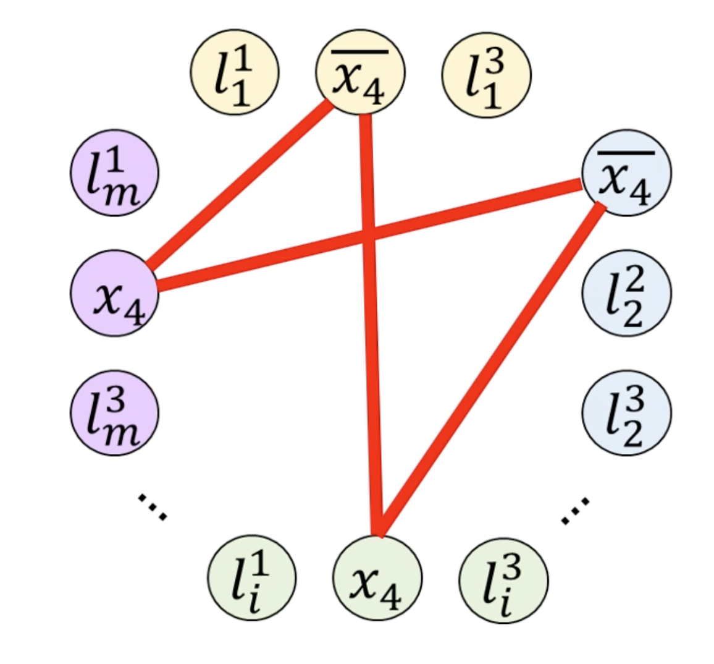
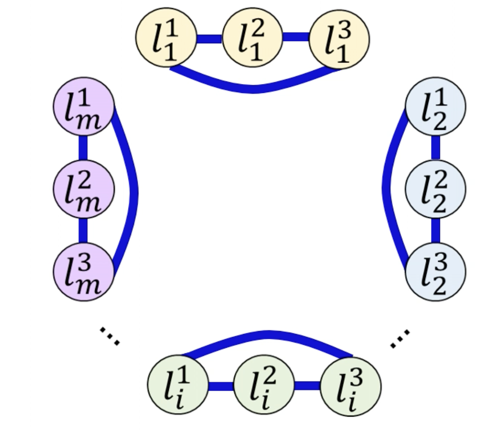
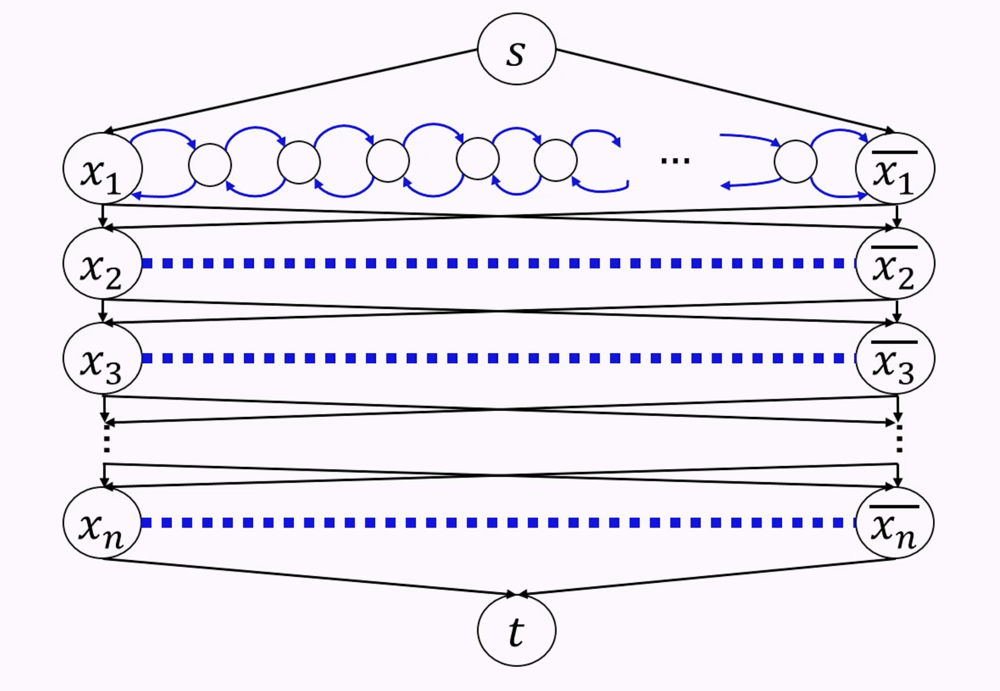
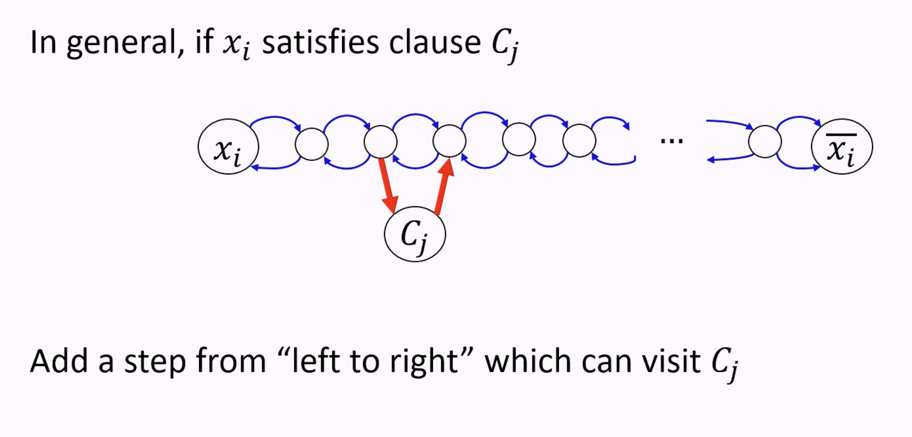
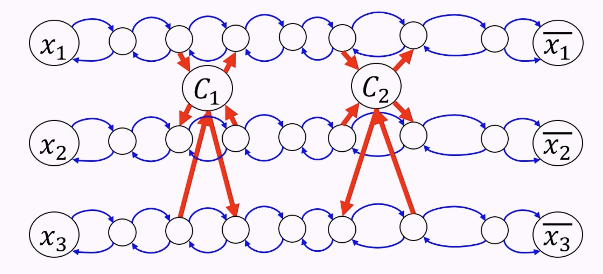

# Reductions
- If you can transform Problem A into Problem B which you already know how to solve, Problem A is reducible to Problem B.
- If Problem B is easy, then Problem A must be easy. Problem A cannot be much harder than Problem B.
- If Problem A is proven to be hard, Problem B is also proven to be hard

## Many-One Reduction
- A **many-one reduction** is a reduction where decision problem A outputs the same answer as decision problem B, given a transformation from input of A to input of B.
    - Decision problem: algorithm that outputs "yes" or "no"
    - Example: "graph contains a clique?" is many-one reducible to "graph has an independent set?" (transformation is inverting edges)
    - Note: **you can _only_ transform the inputs!** e.g. you are not allowed to run problem B multiple times (even a polynomial number of times).
    - We work with these specific types of reductions so we can preserve properties of NP (verifiable in polynomial time).
        - i.e. if we had an "oracle" reduction that called on problem B many times, verifying that B outputs a "yes" would not guarantee that problem A outputs a "yes" in polynomial time.
    - Note that it is easy to reduce a problem to its inverse (CLIQUE to NOCLIQUE) for normal reductions, but not so easy for many-one reductions.
- A **polynomial-time many-one reduction** is one where the transformation can happoen in polynomial time.

### Example of a Polynomial-Time Many-One Reduction
- PCLIQUE returns true if there is a clique in a graph, of size _k_, that contains vertex _v_.
- CLIQUE returns true if there is a clique in a graph of size _k_.
- `CLIQUE ≤ PCLIQUE`, i.e. CLIQUE is reducible to PCLIQUE via a polynomial-time many-one reduction.
    - Input transformation: add a vertex _v_ that's connected to every other node; use size _k + 1_
- `PCLIQUE ≤ CLIQUE`, i.e. PCLIQUE is reducible to CLIQUE via a polynomial-time many-one reduction.
    - Input transformation: delete all vertices that are not connected to _v_

## 3-SAT
- 3-SAT is a problem that deals with boolean expressions joined with AND, OR, and NOT
- **Conjunctive normal form** is a special form of boolean expression where we have  the AND of groupings of ORs
    - i.e. $(x_1 + x_2) * (x_2 + x_3) * (x_4)$
    - Similar to canonical product of sums
    - In a _k_-CNF formula, every sum term has 3 literals
- **Satisfiability**: a boolean expression is satisfiable if there is at least one assignment to each literal such that the statement is true.
- **3-SAT**: given a 3-CNF formula, determine if the formula is satisfiable.

### Reduction to Independent Set
- We can reduce 3-SAT to the question "is there an independent set in this graph?"
- Create a node for each literal
- The independent set should contain a node if its corresponding literal should be set to TRUE
- Edges:
    - Given $x$ and $\neg x$, draw an edge between them because a boolean cannot be true and false at the same time
    
    - Add an edge between every two literals in the same sum-term (to cover every sum-term)
    

### Reduction to Hamiltonian Path
- **Hamiltonian path**: a path that visits each node exactly once

- Two tracks. Edges to allow you to stay on the same path, or cross ot the other path.
- We additionally have paths of nodes between two corresponding vetices in the two tracks.
    - Taking the channel **left to right** indicates setting the variable to TRUE; **right to left** is false
- Remember, you are only allowed to visit each node once, so we can't start going across and come back halfway through!

- We can make sure we satisfy all the clauses by adding "clause nodes"; visiting the clause node = satisfying the clause
    - The clauses act as "diodes"; they make it so that you can only go one way across the channel

- Clauses can be included in multiple paths, so that any variable in the OR clause satisfies it.