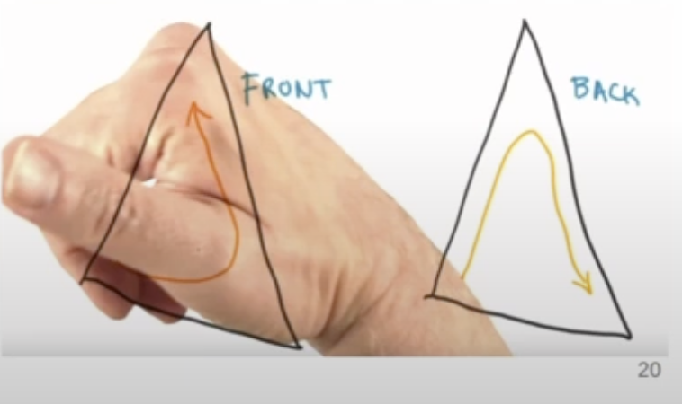

# Meshes

## A Note on Winding Order
- Winding order determines which side of a triangle is the "front" or "back"
- The order the vertices are specified determines the winding order
- Right-hand rule: The curl is the order of the vertices on a triangle, the thumb is the normal

### Face Culling
- Face culling is an optimization that skips rendering of triangles for which you're facing the back of
- Thus, winding order is important to get correct

## Index Buffer Objects
- If we want to make a rectangle with two triangles, we will have two duplicate vertices.
- We can use an Index Buffer Object (IBO) (AKA Element Array Buffers) to store the indices of vertices, so they can be repeated
- _Note: the indices of the IBO must be still read in counterclockwise order_

### Using with VAOs
- A VAO can reference many VBOs (one for position, one for color, etc.)
- A VAO can bind to exactly one EBO
