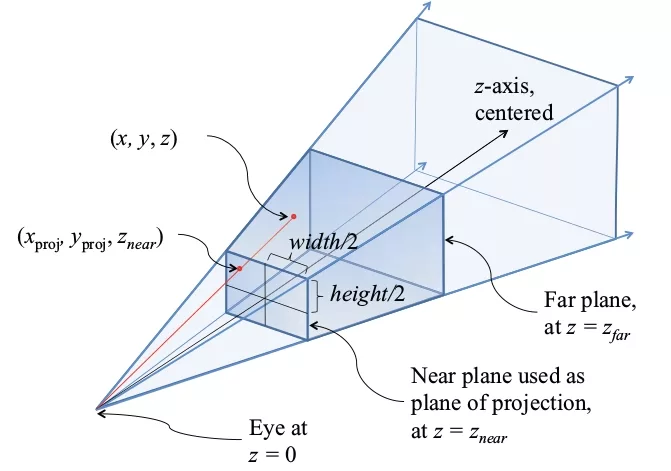

# Camera

To view the scene through a camera, you must transform the camera into world space, then apply the following camera transformation:

$$
\begin{bmatrix}
    R_x & U_x & F_x & 0 \\
    R_y & U_y & F_y & 0 \\
    R_z & U_z & F_z & 0 \\
    -t_x & -t_y & -t_z & 1
\end{bmatrix}
$$

where $R$, $U$, and $F$ are the right, up, and forward vectors of the camera.

## Perspective

- All objects in the view frustrum are _projected_ onto the near clipping plane in a manner that scales them
- You can make use of the `w` (fourth) component of a point to scale points in accordance to perspective (**Homogenous Coordinates**)
    - To convert to screen space, divide the x, y, and z components by w, and remove w
