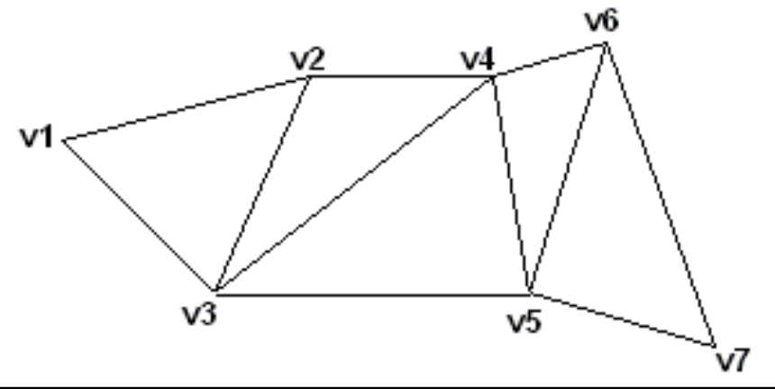
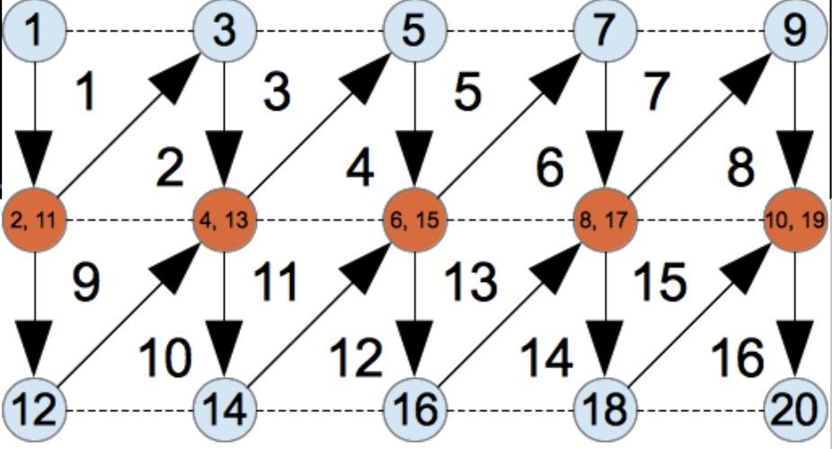
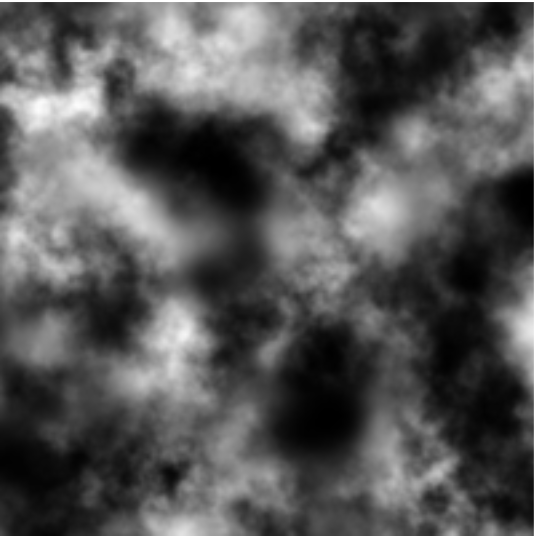

# Terrain
- A terrain is made up of a grid of vertices, each with a specified height

## Triangle Strips
- If we rendered the texture using IBOs, each vertex would be referenced many times
- However, since we are using a grid, we can instead make use of **triangle strips**

## Loading Heights
- Height data can be loaded from a height map (a greyscale image)

## Coloring Terrains
- Textures can be loaded from a color map
- The color map is simply projected onto the terrain

### Multi-Texture Sampling
- You can select from multiple textures based on the height of the vertex
- Or, you can read another map that has different colors to specify which texture to read
