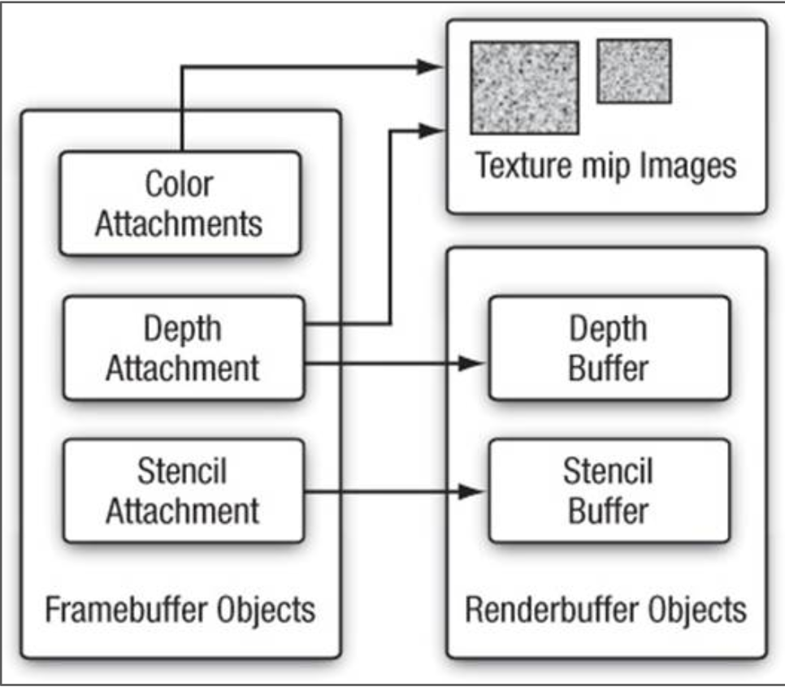

# Frame Buffers
- A frame buffer is a dedicated section of read/write RAMM that puts pixels onto the screen

## Double Buffering
- Two frame buffers can be swapped to prevent flickering

## Frame Buffer Objects (FBO)
- OpenGL automatically creates an FBO which writes to the screen
- However, we can make our own FBOs for intermediate processing
- FBOs are analogous to VAOs, in that they are a container for references

## Screen Buffers
- Screen buffers hold data relating to pixels. There are many types of screen buffers:
    - Color buffer
    - Depth buffer
    - Stencil buffer

### Color Buffer
- Stores the actual color values (RGBA) that we are going to draw

### Depth Buffer
- Stores the Z distance of each fragment of a surface on a screen
- Used for depth test

### Stencil Buffer
- A stencil buffer is used to mask certain areas of the screen
- Example: you can use stencil buffers for a rearview mirror

## Render Buffer Object (RBO)
- An RBO is a "bucket of bytes" that we can store data to
