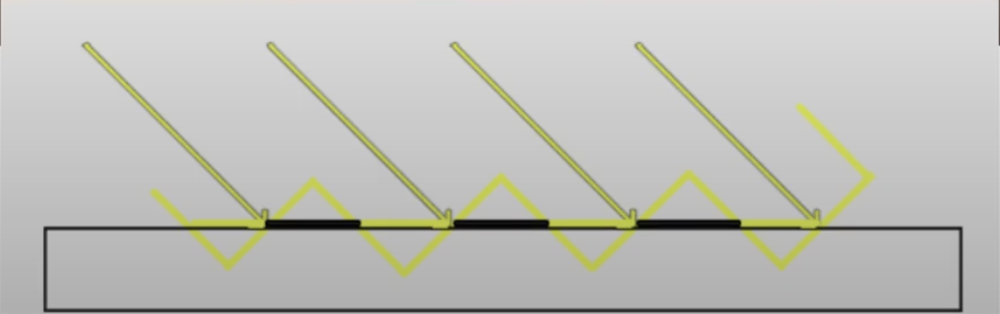

# Shadows

## Raytracing
- Shadows can be computed using raytracing, with rays originating from the light source, checking for collisions with scene objects, and terminating on the surface on which the shadow is cast
- We can use a hack to do this quickly: we can render a Depth Map from the perspective of the light, and use the Depth Buffer to determine which pixels are in shadow

## Optimizations
- Because the resolution is finite, sometimes the shadow only hits a subset of the pixels. This causes "shadow acne"

    - We can fix this by adding a "bias" to the depth value
- We can blur the edges of shadows using a "Percentage Close Filter" (PCF)

## Point Lights
- For a point light, we render the depth map from the light's perspective in all six directions (i.e. forming a cubemap)
