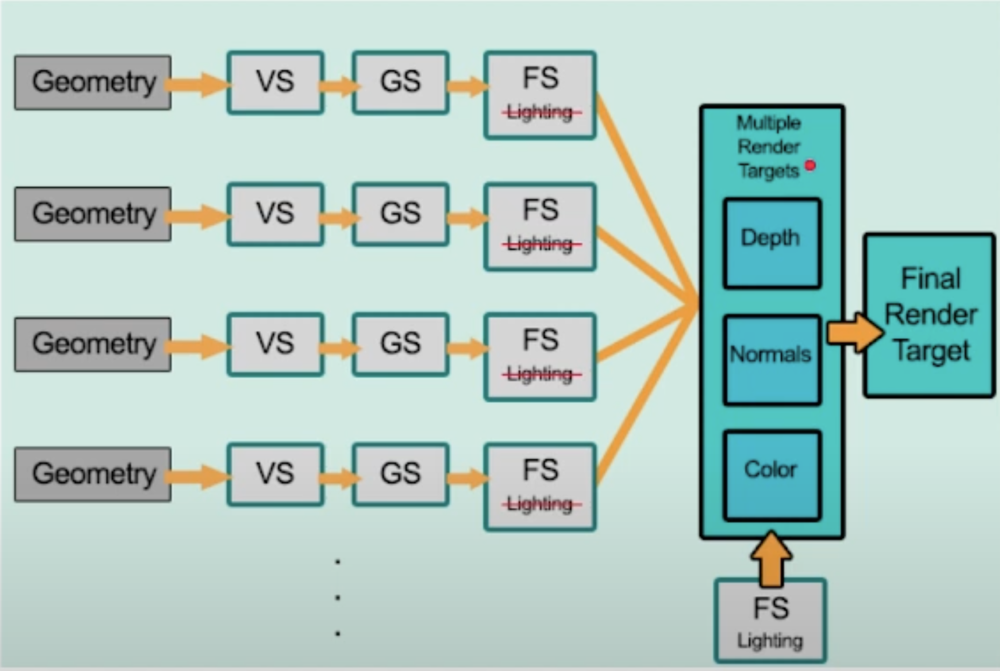
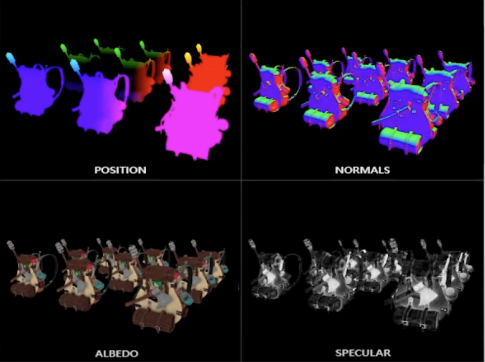

# Deferred Rendering

- Usually, we do lighting calculations in the fragment shader
- However, this constrains us to only having a few active lights per scene
- We can use deferred rendering to extract the lighting calculation from the fragment shader, and instead calculate light _per scene_
- Multiple render targets (position, normals, albedo, specular) are used (called the G-buffer), and lighting is applied in a separate pass
- This way, instead of looping through every light for every pixel, we just loop through lights once; we use the data from the G-buffer to calculate lighting

## Disadvantages of Deferred Rendering
- Transparency is hard—we often have to do a normal forward pass to handle transparent objects
- Deferred rendering uses lots of VRAM, especially if we have multiple 4K G-buffers
