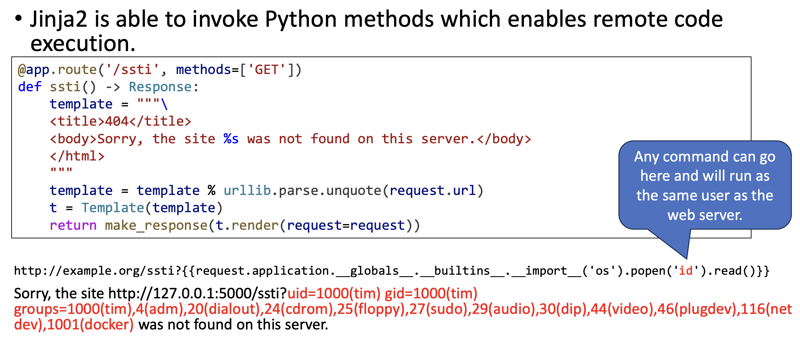

# Remote Code Execution
- Untrusted user input is confused for code on a server

## Template Injecton
- If using a template engine like Flask, the user could add a string replacement reference to a protected variable



## SQL Injection
- If SQL queries are simply concatenated with user input, the user could add a SQL command to the input

```
SELECT * FROM users WHERE name=‘tim' AND password='a' OR 'a' = 'a';
```

### SQL Injection syntax exploits
- You can use single quote to get out of a string
- You can use comments (`--`, `#`, or `/* */` depending on SQL version) to comment out the rest of the query

### UNION SQL Injection
- You can use a `UNION` statement to add a new query to the original query
- You can check how many columns there are on a table by trying `ORDER BY 1`, `ORDER BY 2`... until you get an error (at which point the column doesn't exist)

## Defenses
- Sanitize user input
    - Allowlist/blocklist of control characters
