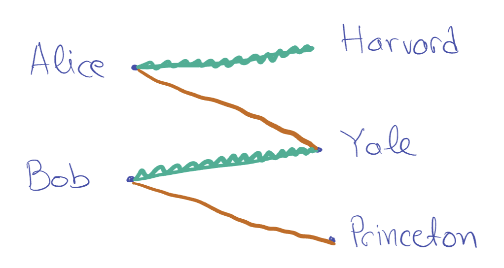

# Stable Matching: Incentive Compatibility

## Notation and Definitions
- $\vec{\prec}$ is a tuple denoting the preference orderings of all students and universities, i.e. $(\prec_{s_1}, \prec_{s_2}, \dots, \prec_{u_1}, \prec_{u_2})$
- $\vec{\prec}_{-s_i}$ is the preference orderings of all students and universities, without one entry
- $M_A(\vec{\prec})$ is the output of the algorithm when the input preferences are $\vec{\prec}$
    - $M_A(s; \vec{\prec})$ is the university matched with student $s$

### Incentive Compatibility
> "No student should be able to 'rig' their preference ordering to get a better outcome."
$$M_A\left(s; (\vec{\prec}_{-s}, \prec_s)\right) \succ_s M_A\left(s; (\vec{\prec}_{-s}, \prec_s')\right)$$

### Attainability
- A university $u$ is **attainable** for a student $s$ if there is a stable matching such that $M(s) = u$.

## Theorem 2.2.
> Every student is matched to their favorite attainable school; and every school is matched to its _least_ favorite attainable student.

Every student proposes to their favorite attainable school. See that $M(s)$ is attainable, and $s$ has proposed to every school that $s$ prefers over $M(s)$ so $s$ has to have proposed to their favorite attainable school.

We also use the observation that every student becomees _less happy_ as the algorithm progresses.

We define a _bad event_ as an event in which a student $s$ is matched with a school that is less desirable than their favorite attainable school.

If this bad event happens, that matching is locked in, since students become less happy.

Consider the first time the bad event happens to a student ("Alice"). The bad event is when Alice is matched with Harvard, which she likes less than her favorite attainable school, Yale.

Since Alice prefers Yale to Harvard, it means Alice proposed to Yale and was rejected. Thus, we can say Yale is matched with a student Bob whom Yale prefers over Alice.

**THIS IS OUR ASSUMPTION THAT CAUSES THE CONTRADICTION: THAT YALE REJECTED ALICE FOR BOB**

Let $M'$ be the stable matching where Alice is matched with Yale (the good ending). $M'$ necessarily exists because Yale is attainable for Alice.

Let Princeton be Bob's match in $M'$.

> Green: matching during the run where the bad event happens
> 
> Red: $M'$ that shows Yale is attainable for Alice

But, within the matching $M'$, Yale and Bob both prefer each other over their current matches. This creates a blocking pair in $M'$. This creates a contradiction, and our presupposition that $M'$ is stable and that Yale was attainable for Alice is false.

## Theorem 2.1. The algorithm is incentive compatible for all students
[[ TODO ]]