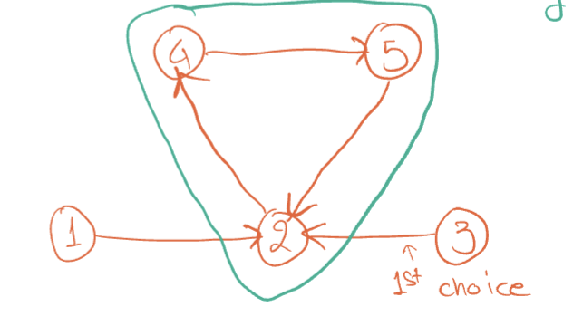
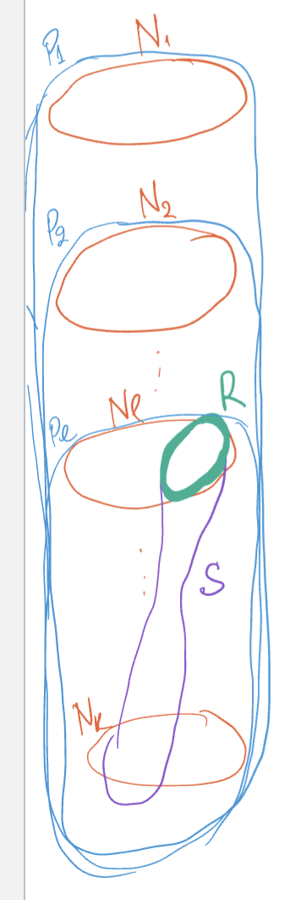

# One-Sided Matching Market (Kidney Exchange)

## Definitions and Notation
- $P$: patients that need a kidney
- $D$: donors that are willing to give a kidney
- $M_0$: initial matching
- Each $p \in P$ has a preference list $\succ_p$.

### Blocking Set
- A blocking set for $M \subseteq P \times D$ with initial matching $M_0$ is a set $A \in M_0$ and a matching $M^{(A)}$ over $A$ such that
    1. $\forall p \in A \vert M^{(A)}(p) \succeq_p M(p)$
    2. $\exists p \in A \vert M^{(A)}(p) \succ_p M(p)$ 
- i.e. every patient is at least as happy as before, and at least one patient is more happy.

### Stable Matchings
- A matching is stable if it has no blocking sets.

### Graphs
- You can construct a graph with nodes as patients, where an edge $(p_1, p_2)$ signifies that $p_1$'s first choice is $p_2$'s current match.
- You can see blocking sets by the presence of cycles in the graph.




## Top Trading Cycle Algorithm
> Note: this is similar to the strategy of repeatedly finding augmenting paths in Bellman-Ford, in that you start with a naïve graph and repeatedly make it better.

```
N: remaining patients
N = P
while there are elements in N:
    G = (the graph as described above)
    C = cycle in G
    Trade donors along C
    N = N\C
```

## Observation. TTCA terminates
- Note that every directed graph where each vertex has an out-degree = 1 has a directed cycle.
    - If it were a path graph, the last vertex would have an out-degree of 0.
- Since there is always a cycle, we will always reduce the number of remaining patients (nodes in the graph) every step, so the algorithm must terminate.

## Theorem 3.1. TTCA outputs a stable matching
- PROOF BY CONTRADICTION: let's assume that TTCA outputs an **unstable** matching (i.e. there is at least one blocking set).
- In this proof, we will consider the _smallest_ blocking set, $\ell$, and create a contradiction.

### Definitions for Theorem 3.1

- "to match": to match a patient is to remove them from the graph.
- $N_j$: set of patients matched (removed from the graph) in the $j$th iteration of TTCA
- $S$: the smallest blocking set
- $\ell$: first iteration of TTCA such that $N_{\ell} \cap S \neq \emptyset$, i.e. the first iteration where the smallest blocking set appears
- $R$: the specific patients who are _both_ in $S$, _and_ were matched in cycle $\ell$, i.e. $N_{\ell} \cap S \neq \emptyset$



### Proof
1. At the start of iteration $\ell$, every patient who hasn't been matched points to their favorite available option.
2. Because $\ell$ is the first time we are touching $S$, we know that at this moment, **every single patient in $S$ is still available.**
3. When iteration $\ell$ comes along, some of the elements we match (remove from the graph) are part of $S$; this intersection is called $R$.
4. By virtue of elements $R$ being matched, and the nature of the algorithm, we know that those elements are as happy as they'll ever be; they're pointing to their #1 favorite choice among _all remaining unmatched patients_, which _includes_ all elements in $S$ (see step 2).
5. So, the patients in $R$ couldn't be made happier by swapping donors with other patients in $S$.
6. Thus, we've constructed a blocking set $S \setminus R$ which is smaller than $S$. But, we defined $S$ as the _smallest_ blocking set! This is absurd.
7. Thus, there cannot be a blocking set output by the algorithm.
