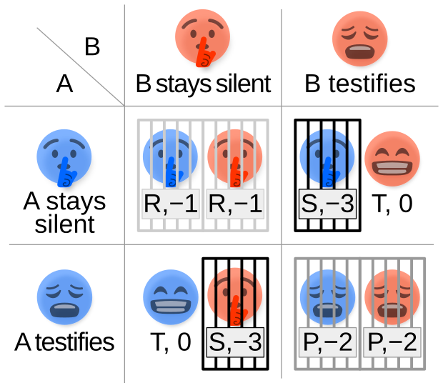
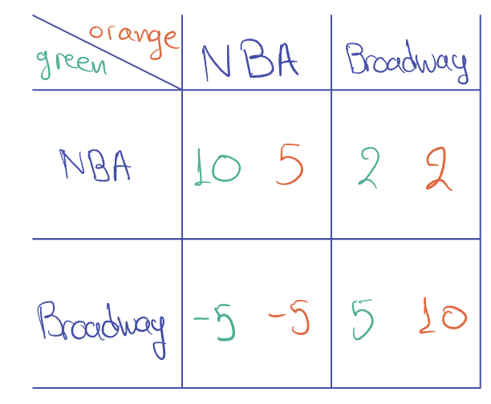

# Introduction to Game Theory

## Definitions
- $n$ _rational_ players
- Player $i \in [n]$ has set of $m$ strategies $S_i$
- Strategy profile: $\vec{S} = (S_1, \dots, S_n)$
- Player $i$ has payoff $r_1(\vec S) \in \real$

### Domination
- Strategy $s$ dominates a strategy $s'$ for player $i$ if, for all $s_{-i}$, $$r_i(s, s_{-i}) \ge r_i(s', s_{-i})$$
    - That is, choosing strategy $s$ always gives a better outcome than choosing strategy $s'$, no matter what the other players do
    - A strategy _strongly_ dominates if the it's $\gt$ instead of $\ge$
- A strategy is a **dominant strategy** for a player if it dominates all other strategies.
- $\vec s$ is a **dominant strategy equilibrium** if $s_i$ dominates $s'_i$ for all $s'_i \ne s_i$ and _for all players_ $i \in [n]$
    - That is, $s$ strongly dominates all other strategies, _for all players_

### Dominated Strategies
- A **dominated strategy** $s$ is one where there exists a strategy $s'$ that _strongly dominates_ $s$.
- A **level-2 dominated strategy** is a strategy that is dominated within the sub-game after all dominated strategies have been removed.
    - Formally, let $\overline{S_i^{(1)}}$ be the set of dominated strategies of player $i$ in game $G$. Define game $G^{(1)}$ with set of strategies $S_i^{(1)} = S_i \setminus \overline{S_i^{(1)}}$ for all $i$. Then a strategy $s$ of player $i$ is **level-2 dominated** in $G$ if $s$ is dominated in $G^{(1)}$. 
    - With induction, we can have a **level-k dominated strategy**.
- A game is **solvable by iterative deletion** such that $S_i^{(k)}$, i.e. the set of remaining strategies after $k$ deletions, is of size one.
    - The one strategy left is called the **rationalizable equilibrium**.

### Pure Nash Equilibria
- A strategy profile is a **pure nash equilibrium** if no player can increase their payoff by changing their own strategy. $$r_i(s_i, \vec{s_{-i}}) \ge r_i(s'_i, \vec{s_{-i}})$$

> Note: the difference between dominant strategy equilibrium and pure nash equilibrium is that for DSE, the equation holds _for all_ $\vec s_{-i}$, but for PNE it only holds for the one that corresponds to the equilibrium strategy. Notice that DSE talks about *strategies*, but PNE talks about *strategy profiles*.

## Examples

### Prisoner's Dilemma

In the Prisoner's Dilemma, there is a **dominant strategy equilibrium** of _confess_.

### 2/3rds Game
> Two players pick a number from 0 to 100; they want to get as close to submitting 2/3rds of the average of the submissions.

$$r_1(s_1, s_2) = - \lvert s_1 - \frac{2}{3} \frac{s_1 + s_2}{2} \rvert = - \lvert 2s_1 - s_2 \rvert$$

- There is no dominant strategy since the optimal strategy for each player depends on what the other person picks.
- The strategies of submitting $s_1 = 100$ is _dominated_, so there is no reason for anyone to ever play $100$. Thus, we exclude those strategies from the game.
- But this logic inducts to 99, 98, 97, etc.
    - 99 is **level-2 dominated**, 98 is **level-3 dominated**, etc.
- Eventually, we deduce that the only rational strategy is to submit $s_1 = s_2 = 0$.
- So, this game is _solvable by iterative deletion_.

### Battle of Preferences
> Two friends are deciding how to spend their weekend. They want to go together, but they both individually prefer different activities.

- There is no dominant strategy _nor_ are there dominated strategies. However, this game has _pure nash equilibria_: `(NBA, NBA)` and `(Broadway, Broadway)`.
