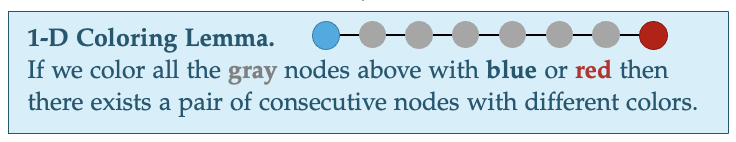
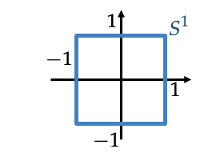
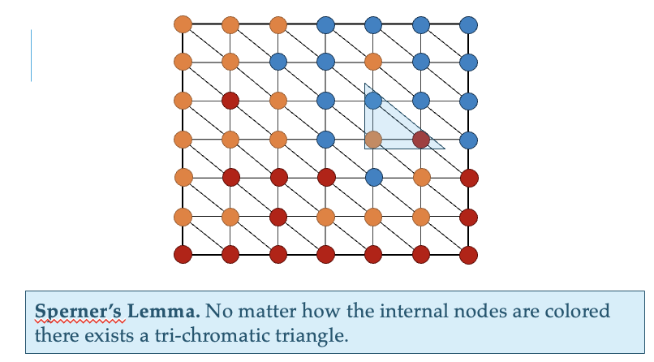

# Intermediate Value Theorems

## Theorem 1
For a continuous function $f$ on domain $[a, b] \rightarrow \real$, the function passes through 0, i.e. $\exists x^\star \text{ s.t. } f(x^\star) = 0$

## Theorem 2: Fixed Point Version
For a continuous function $f$ from $[-1, 1] \rightarrow [-1, 1]$, the function passes through the line $x=y$, i.e. $\exists x^\star \text{ s.t. } f(x^\star) = x^\star$

## Lipschitz Continuity
A function $f: [a, b] \rightarrow \real$ is **Lipschitz continuous** if $$\exists L \gt 0 \quad \vert \quad \lvert f(x) - f(y) \rvert \le L \cdot \lvert x - y \rvert$$

## Coloring Lemma

## 2D Intermediate Value Theorem

Imagine we have an $\real^2 \rightarrow \real^2$ function (such as a vector field on a plane).

We can use a coloring lemma similar to the 1D version to prove the 2D IVT.

