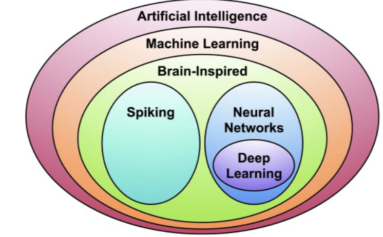
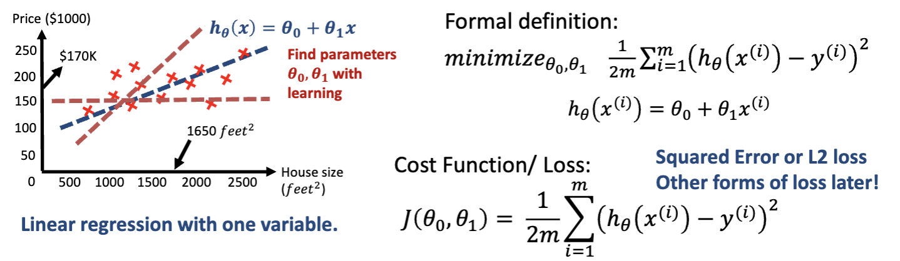
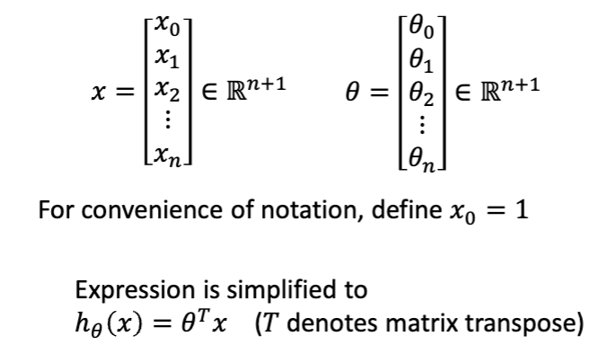
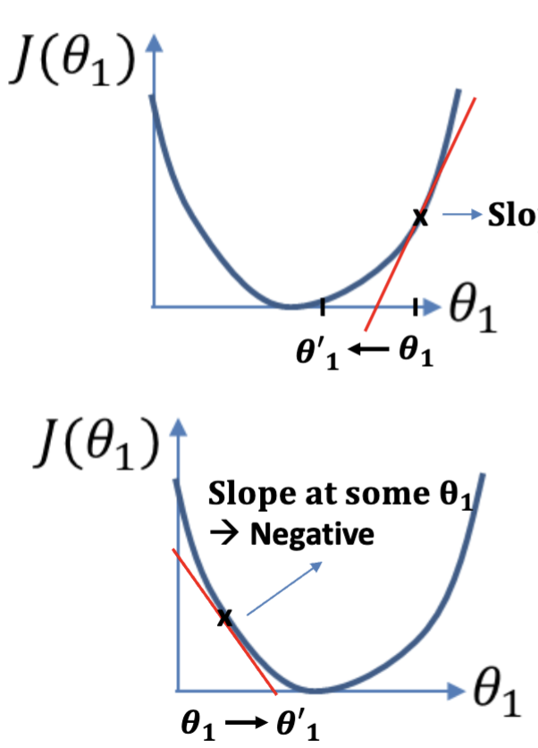
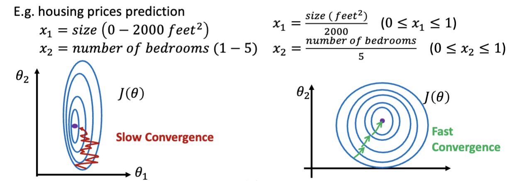

# AI and ML

- **Machine Learning**: Field of study that gives computers the ability to learn without being explicitly programmed
- **Neural Networks** and **Deep Learning**: ML using dot product of inputs, inspired by the brain's structure
- **Spiking**: inspired from brain-like computations of "spikes" or "events"

## Machine Learning
Within ML, there are different algorithms.

- **Supervised Learning**: regression, classification, etc. Labels are given
- **Unsupervised Learning**: clustering, etc. No labels given
- Others: Reinforcement learning, Semi-supervised learning

# Basic Supervised Learning
Take the example of predicting housing prices based on: _size_, _# of bedrooms_, _zip code_, and _wealth_.

## Linear Regression of a single variable

For a single variable, we can take a linear regression to create a prediction. We can calculate the error—usually **Mean Squared Error**, AKA **L2 Loss**.

> **Note**: Notation
> - $\theta_n$: the *n*th weight/parameter
> - $x_n$: the *n*th input parameter
> - $y$: the output
> - $\hat{y}$: the predicted output
> - $J(\theta_0, \theta_1, \ldots, \theta_n)$: the loss function

### Multi-varriable Linear Regression
**Note**: Transposition
To represent $h_\theta(x)=\theta_0 + \theta_1 x_1 + \theta_2 x_2 + \ldots + \theta_n x_n$, you can use a vector transposition $h_\theta(x)=\theta^Tx$.

## Gradient Descent

Gradient descent minimizes the loss function by "descending" the error curve.

1. Start with some random weights $\theta_0, \theta_1, \ldots, \theta_n$
2. Change the weights, proportional to the partial derivative of each variable, to minimize the loss function
    - $\theta_n = \theta_n - \alpha \frac{\partial}{\partial \theta_n} J(\theta_0, \theta_1, \ldots, \theta_n)$
3. Repeat step 2 until the loss function is minimized

### Hyperparameters
Hyperparameters are not trainable; instead, they are user-defined.

For example, $\alpha$ determines how much the weights are changed in each iteration.

### Good Practices for Gradient Descent
- Try to make your parameters on the same scale / order of magnitude.

