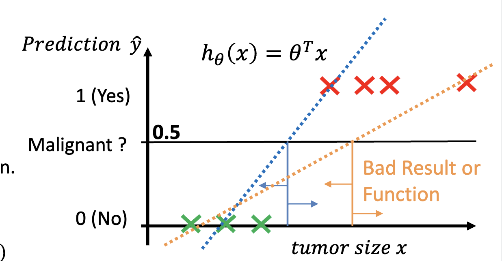
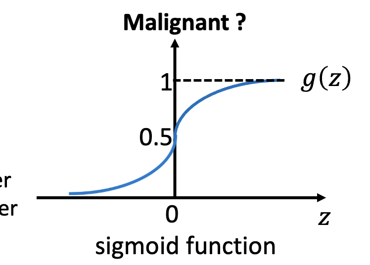
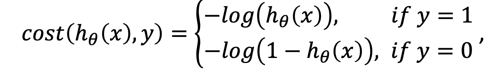
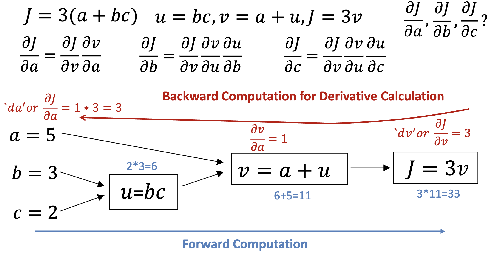

# Classification
- A classifier model should output a probability of the input belonging to a class.

## Binary Classification
- Any classifier tries to optimize the **decision boundary**, the line that separates the two classes.

### Linear Regression
- To classify a binary output, you can use linear regression.
- Use regression to draw a line that divides the two classes. At any point, the predicted output is the probability of the input belonging to the class.

### Logistic Regression
- *Logistic* means the same thing as *sigmoid* and is defined by $h_0(x) = \frac{1}{1 + e^{-\theta^Tx}}$.
- Sigmoid squashes values to the range $[0, 1]$.

#### Cost Function
- You cannot use the same cost function as linear regression because the sigmoid function is non-linear.
    - This results in a non-convex cost function, which can cause local minima.
- Instead, use the formula:

#### Training
- You can train a logistic regression by using backward computation with partial derivatives.

- Partial derivatives tell you how much each parameter affects the cost function.
- For sigmoid, the derivative is $\frac{d}{dx} \sigma(x) = \sigma(x)(1 - \sigma(x))$.

## Non-Binary Classification
- Use many binary classifiers to classify multiple classes.
