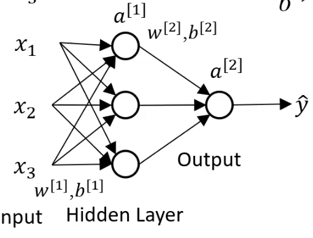
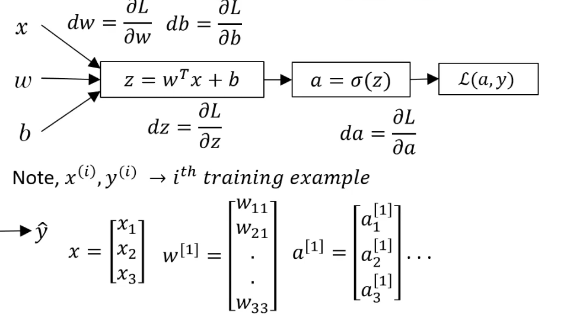
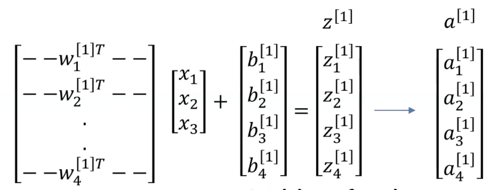

# Neural Networks

## Motivation
If you were to use a logistic regression for a dataset with many features (inputs), the number of parameters to train would grow with the square of the number of features.

$$
h_\theta(x) = \sigma(\theta_0 + \theta_1 x_1^2 + \ldots + \theta_{100} x_1x_{100} + \ldots)
$$

Neural networks are equivalent to multiple logistic regressions chained.

## Notation
- $z = W^T x + b$: raw weighted sum of inputs
- $a = \sigma(z)$: the _activation_, aka output of a neuron ($z$, put through activation function)
    - $a^{[l]}$: the vector of outputs for layer $l$
- $w^{[l]}$: the vector of weights for layer $l$
    - $w_{ij}$: weight from neuron $i$ to neuron $j$
- $b^{[l]}$: the vector of biases for layer $l$
    - $b_i$: bias for neuron $i$

## Vectorized Training

### 1. Weights and Biases
Let $W^{[n]}$ be the matrix of weights for layer $n$. This matrix has dimensions `(# nodes in layer n, # nodes in layer n-1)`.
$$
W^{[1]} = \begin{bmatrix}
w_{11} \\
w_{21} \\
\vdots \\
w_{43}
\end{bmatrix}
$$

Let $B^{[n]}$ be the vector of biases for layer $n$. This vector has dimensions `(# nodes in layer n, 1)`.
$$
B^{[1]} = \begin{bmatrix}
b_1^{[1]} \\
b_2^{[1]} \\
\vdots \\
b_3^{[1]}
\end{bmatrix}
$$

### 2. Inputs

Let $X$ be the matrix of all inputs, with each column being one training example.

Each cell in each training example is the *n*th input.
$$
X = \begin{bmatrix}
| & | & & | \\
x^{(1)} & x^{(2)} & ... & x^{(m)} \\
| & | & & |
\end{bmatrix}
$$
- Dimensions: `(# inputs, # training examples)`

### 3. Calculate Activations

Then, calculate the raw weighted sum of the first hidden layer. Let this be $Z^{[1]}$.

$$
Z^{[1]} = \begin{bmatrix}
| & | & & | \\
z^{[1](1)} & x^{[1](2)} & ... & x^{[1](m)} \\
| & | & & |
\end{bmatrix} \\
$$
- Dimensions: `# nodes in hidden layer 1, # training examples)`

Calculations:
- For each
    - training example (column in $Z^{[1]}$)
        - for each
            - node in hidden layer 1
                - calculate the raw weighted sum of that node, $z_n^{[1]}$.

$$
z_1^{[1]} = w_1^{[1]T}x + b_1^{[1]}\\
\vdots\\
z_n^{[1]} = w_n^{[1]T}x + b_n^{[1]}\\
$$

Then, pass $Z^{[1]}$ through the activation function to get $A^{[1]}$.

$$
A^{[1]} = \begin{bmatrix}
| & | & & | \\
a^{[1](1)} & a^{[1](2)} & ... & a^{[1](m)} \\
| & | & & |
\end{bmatrix}
$$

## Activation Function
- Historically, people have used sigmoid activation function to mimic the brain.
- However, the sigmoid function has a derivative that is close to zero for most of its range, which can slow down learning.
- Nowadays, scientists use the ReLU (Rectified Linear Unit) activation function.
- However, if neurons start in the $(-\infty, 0]$ range, they may never activate, causing a "dead" ReLU.

> Note: if you do not have an activation function, the neural network is mathematically equivalent to a linear regression. For non-linear data, you need an activation function.

## Backpropagation

First, find $da^{[n]}$—the error of the output layer. (For hidden layers, this is simply the difference in activation of the next layer)

Use the chain rule to find the error in the raw weighted sum, $dz^{[n]}$.

$$
dz^{[n]} = da^{[n]} * \sigma'(z^{[n]})
$$
Change the weights based on how much it contributed to the error.

$$
dw^{[n]} = dz^{[n]} * a^{[n-1]}
$$

Change the bias based on the error.

$$
db^{[n]} = dz^{[n]}
$$

Then, calculate the error in activation in the previous layer.

$$
da^{[n-1]} = w^{[n]T}dz^{[n]}
$$

And repeat until you get to the input layer.

> ## Note: Data Practices
> - It is best to segment training data into three sets:
>     1. Training set: data used to train the model.
>     2. Validation set: data used to tune hyperparameters.
>     3. Test set: data used to evaluate the model.