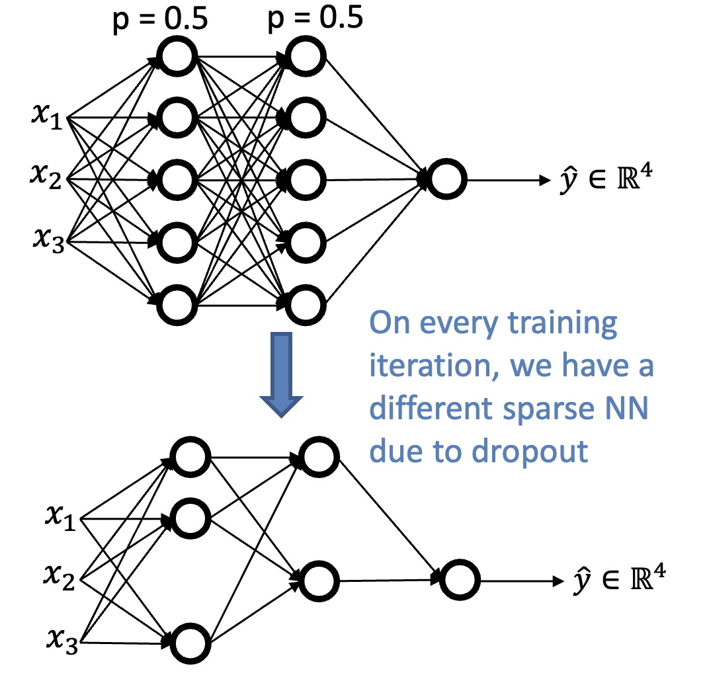

# Training Problems & Optimizations

## Bias and Variance
- High bias: underfitting
    - Training has not been performed properly
    - High error on training and test data
- High variance: overfitting
    - Model is memorizing the training data
    - Low error on training data, high error on test data
- High bias and high variance
    - Model is failing in training, and also memorizing data
    - High error on training data, even higher error on test data

## Preventing Overfitting with Regularization
- Regularization slows gradient descent propagation, to reduce overfitting.
- We assume high weights means a more complex model; you are penalizing models with high weights by adding the squares of the weights to the cost
- This is called weight decay or L2 regularization

$$
J(w, b) = \frac{1}{m}\sum_{i=1}^{m}{L(\hat{y}^{(i)}, y^{(i)})} + \frac{\lambda}{2m}\sum_{l=1}^{L}{||W||_2^2}
$$

- Effectively, you are decaying $w^{[l]}$ by $(1 - \frac{\alpha\lambda}{m})<1$

### Dropout Regularization
- You can randomly turn off neurons during training, to prevent overfitting.

- Cost function may be noisy due to random dropout, but network will still converge

### Data Augmentation
- You can create more data very easily by rotating, flipping, cropping, and distorting images

### Early Stopping
- If you're training too much, the model may become overfitted. You can stop training early to curtail overfitting.

## Vanishing/Exploding Gradients
- If you initialize the weights to something too big, the output will explode (i.e. approach infinity). If they are too small, the output will vanish (i.e. approach zero).
- This will negatively affect convergence

## Mini-batch Gradient Descent
- With normal batching, weights are only updated once the _entire_ training set is run through.
- You can update weights partially through the training set with mini-batching, which can speed up training.
- Mini-batch error may be noisy, especially if the mini-batch size is small.

## Momentum
- To avoid local minima, you can use momentum to keep the gradient descent going in the same direction.
- Instead of using the error from one training run, use a **moving weighted average** of the last _n_ runs to update weights.

## Batch Normalization
- Normalizing the activation on intermediate layers (in addition to input data) makes the NN more robust to hyperparameter choices
- Controls **covariate shift**: later layers of the network are more robust to changes in weights in earlier layers
