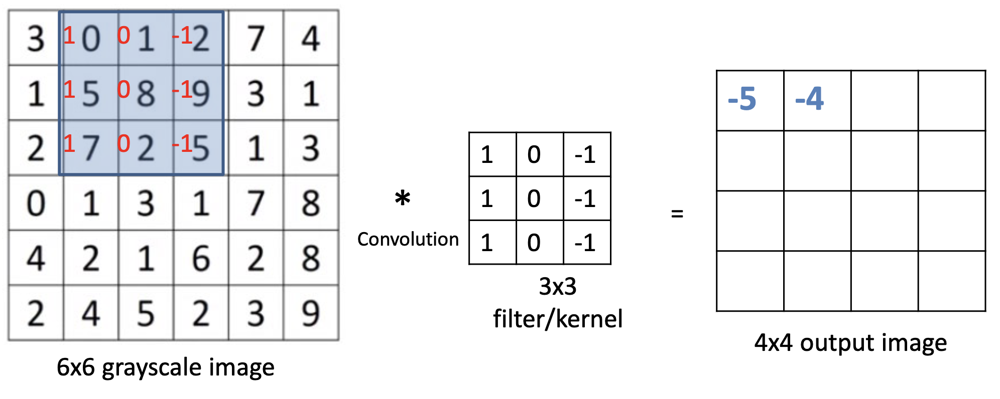
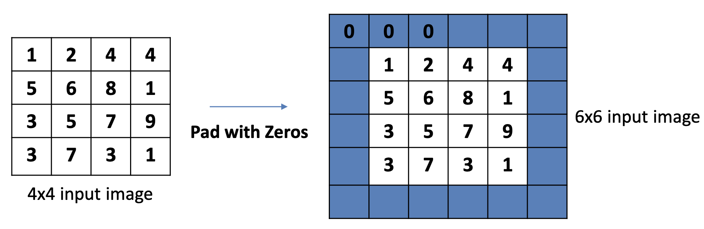
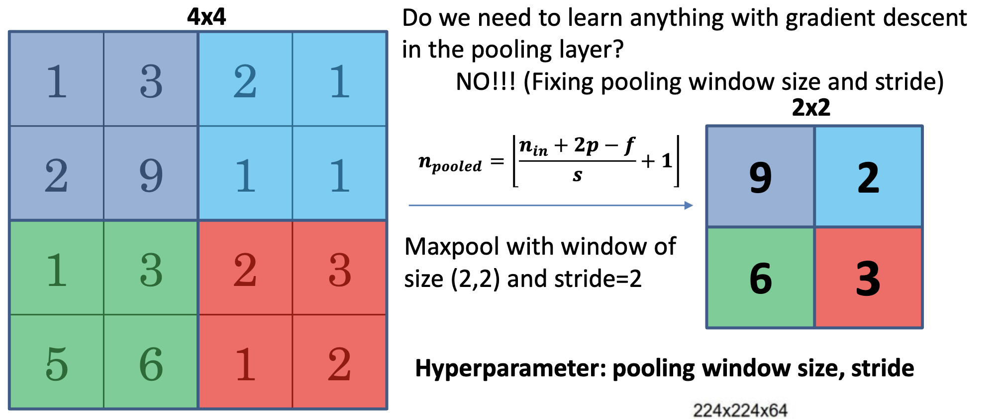
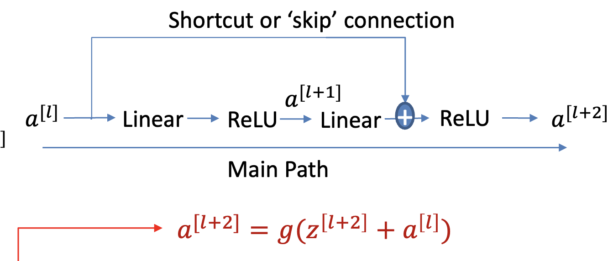
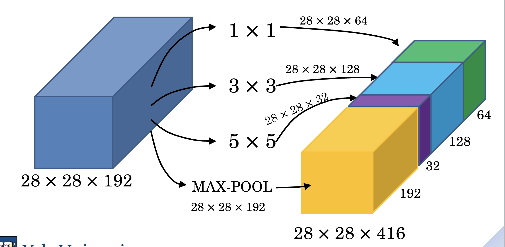
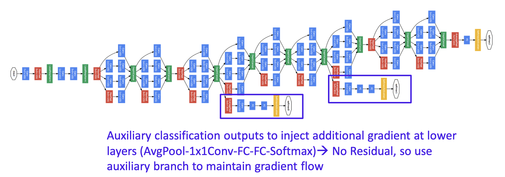

# Convolutions

## Motivation
- For large grid-like datasets, like images in CV, we need to reduce the number of inputs
- We can use convolution operations to extract features from the input data

### Additional Perks
- Parameter sharing
    - Translation invariance: the model is resilient against lateral/vertical translations of the image subject
- Sparsity of connections
    - Fewer connections/parameters means less overfitting

## The Convolution Matrix
- We can handcraft convolution patterns to detect specific features, like edges

- However, nowadays, we can learn the best convolution pattern to use by treating the convolution matrix as weights

## Optimization Techniques

### Padding
- Due to the nature of the convolution operation, the edge cells are looked at less times than the center cells
- So, we can pad the image with zeroes to make sure all cells are looked at equally

- With padding, the output dimensionality will be $n + 2p - f + 1$
    - $n$: input size (height/width)
    - $p$: padding size
    - $f$: filter size (height/width)

### Striding
- Strided convolutions move the filter across the input image more than one pixel at a time
- Output size: $\frac{n + 2p - f}{s} + 1$
    - $s$: stride size

### Multiple Filters
- You can have multiple filters go through the same input to extract different features
- This will create _n_ different output matrices

### Pooling
- Pooling is a technique to simply reduce the size of the input data
- You take an _n_ by _n_ segment of the input, and apply a simple mathematical function (like _max_ or _average_) to get the output of the pooling

### Residual Networks (ResNets)
- Going through many layers can diminish gradient flow
- You can add shortcuts from previous layers to later layers to help gradient flow
    - Forward propagation: literally add the output of a previous layer to the output of a later layer
    - Backward propagation: the gradient will flow through the shortcut as well

### Inception Network
- The subject of an image may be many different sizes, i.e. in the background (small) or in the foreground (big)
- So, you can use many different filter sizes on a given layer, which will give you many different outputs
- The many different outputs are then concatenated

#### Auxiliary Branches
- GoogLeNet makers realized that the concat step acts as a bottleneck, and inhibits the gradient.
- So, they added auxiliary, meaningless outputs that help with gradient flow. Error is calculated for these meaningless outputs too

## Forwards Propagation
- The forward pass through convolution and pooling layers is straightforward

## Backwards Propagation
- Through a convolutional layer, gradients for each input are computed proportional to the gradients of the outputs, times the weights of the filter
- Through a pooling layer, the gradient is proportional to each input's contribution to the pooled output
    - Maxpool: only the max value gets the gradient, others get zero
    - Average pool: all values get a gradient, divided by the number of values in the pool
