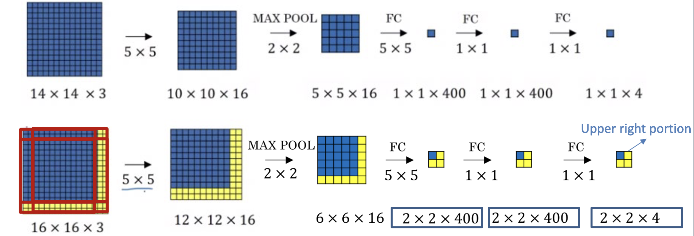
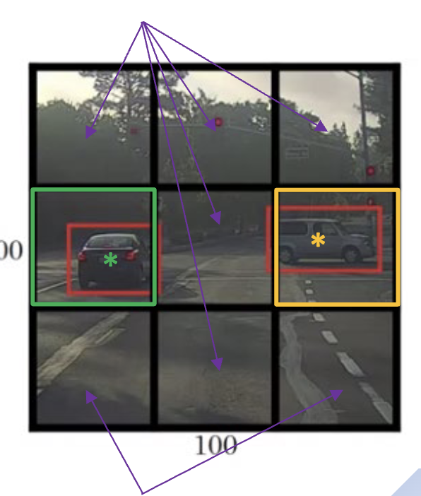

# Localization
- For image classification tasks, it's often useful to draw bounding boxes around objects

- We can add output parameters to indicate the bounding box
    - $p_c$: is there an object or background?
    - $b_x, b_y, b_h, b_w$: bounding box parameters
- The loss function is the sum of:
    - Mean-squared error for $p_c$ and bounding box
    - Cross-entropy loss for class prediction

## Sliding Window Detector
- For each window size, you can slide the window across the image and run the classifier on each window. Hopefully, one of the windows should predict an object

### Images of Multiple Dimensions
- You can use Sliding Window to predict images of a different size than your training set.
- Ex. predict on 16x16 images, but model was trained on 14x14 images
    1. Take a 14x14 window/crop, run the classifier
    2. Slide the window over, run the classifier again
    3. Repeat until you've covered the entire 16x16 image (granted, with some overlap determined by stride size)
- However, you can make this more efficient by passing all _n_ windows at the same time. This can be achieved if you replace fully-connected layers with convolutional layers
    - This uses more memory, but speeds up computations
- You can also predict images smaller than the training set by zero-padding

> Ex. running two different images, one 14x14 and one 16x16, through the convolutionized network
> 

### Sliding window not lining up
- You could split a large image into grid cells to break down the problem
- The "You Only Look Once" (YOLO) algorithm is an implementation of this

**YOLO approach**
1. Take an _n_ by _n_ grid over your image.
2. Apply image classification to each cell.
3. Take the output of the grid cell predictions, and reconcile them
    - They need to be reconciled because an object overlapping multiple grid cells may be detected multiple times with different bounding boxes
    - You can use the IoU function (area of intersection ÷ area of union)
    - Take the bounding boxes with the higheest $p_c$ value, then keep the one with the highest IoU
4. Output the best bounding boxes

> Note: grid cell output dimensionality
> - The size of the output of the grid cells will be $n \times n \times (c + 5)$, where _c_ is the number of classes; plus 5 because of $p_c$ and the bounding box outputs
> - Now, the bounding box coordinates are relative to the width of the grid cell; $b_h$ and $b_w$ are percentages of the grid cell width and height
>   - Although, they can be negative or greater than 1 to represent an object that's bigger than a grid cell
