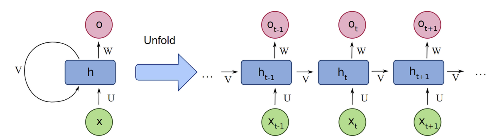
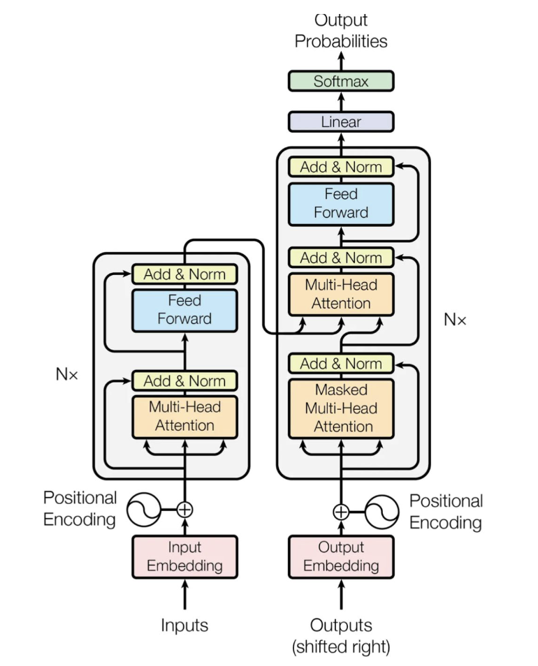
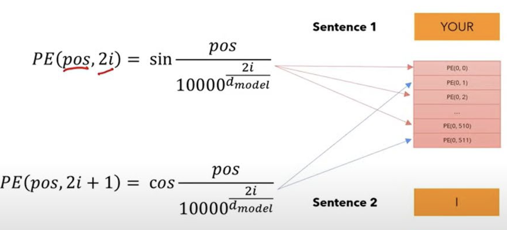
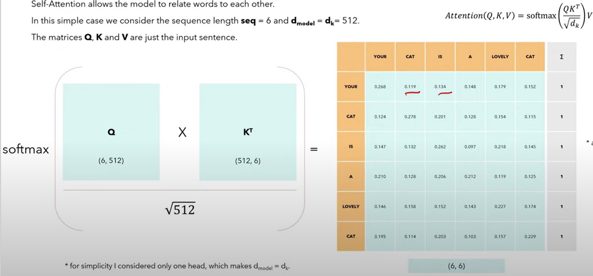
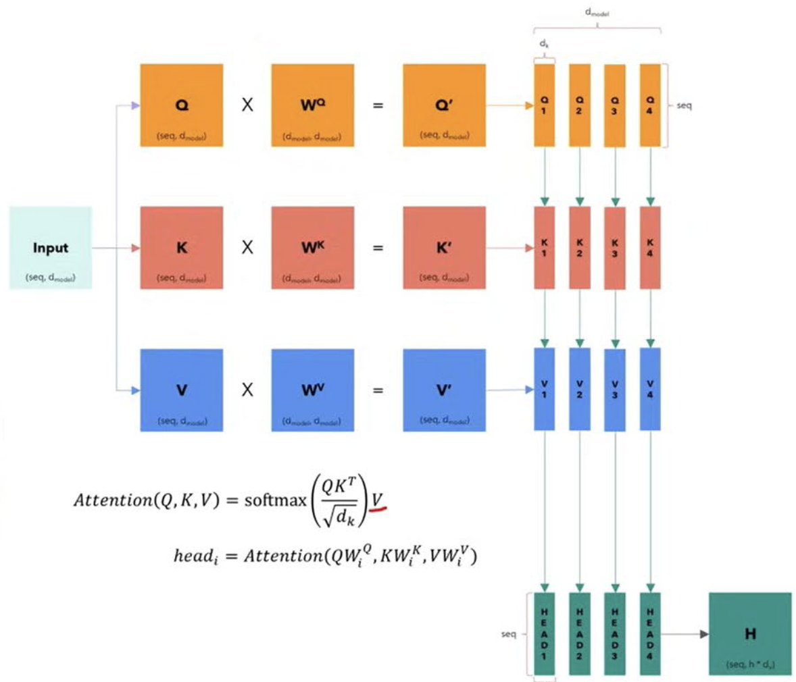
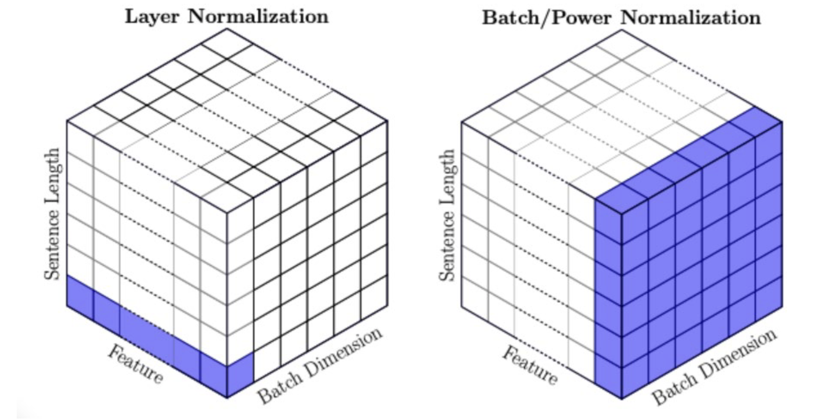

# Transformers

## Original idea: Recurrent Neural Networks
- A RNN can take in a sequence of inputs, and predict the next in the sequence
- RNNs have a state parameter that are shared from iteration to iteration
- During backpropagation, gradients from the last output are propagated all the way to the first input
- However, RNNs have a few drawbacks:
    - The current state remembers the recent past, but may not remember long-term past
    - Suffers from gradient instability (vanishing/exploding gradients)
    - Very slow to compute when the sequence is very large

## A better approach: Transformers
- Transformers are split into two blocks: encoder and decoder
- The encoder data is combined into the decoder, which is then turned into output in a head

## Machine 1: Encoder

### 1. Input Embedding
1. The input stream is converted into a string of tokens
2. Each token is converted into a number, based on the vocabulary ID
3. The ID is projected onto an _n_-dimensional vector based on trained weights
    - Hyperparameter for vector size: $d_{model}$
6. The embedding is added with a **positional encoding**, which is a precalculated value that tells the model where the token is in the sequence. The output is the final **input embedding**
    - Positional encoding formula:
        - For even: $PE_{(pos, 2i)} = \sin(\frac{pos}{10000^{(\frac{2i}{d_{model}})}})$
        - For odd: $PE_{(pos, 2i + 1)} = \cos(\frac{pos}{10000^{(\frac{2i}{d_{model}})}})$
    - Trig functions have natural continuous patterns, so it's easy for the model to detect relative positions
    - It alternates between sine and cosine to reduce the incidence of the same _k_ mapping to the same values
 

### 2. Attention

#### Self-attention

- The attention mechanism tries to relate tokens to each other, e.g. "animal" and "cat" will have a high attention, or a pronoun and its referent
- Encoder input is copied three times, into Query, Key, and Value

$$
\text{Attention}(Q, K, V) = \text{softmax}\left(\frac{QK^T}{\sqrt{d_k}}\right)V
$$

> Example: 6 tokens, vector size of 512
> 1. Multiply Query by Key's transpose
> 2. This gives you the attention scalars (6x6). The closer two tokens are semantically, the greater their attention scalar 
> 3. Multiply by Value to get the attended output (6x512)

- The attention operation is $O(n^2d)$, so it grows with the number of tokens squared

#### Multi-head attention
- You can split the attention mechanism into multiple heads, which allows the model to focus on different parts of the input
- You can add trainable parameters to the attention mechanism
    - Weights for each of Query, Key, and Value
    - Weights to be multiplied by the output of the concatenated heads

### 3. Layer Normalization
- Normalizes the output of the attention mechanism
- BatchNorm normalizes by columns (features)
- LayerNorm normalizes by rows (data items)

### 4. Feed Forward
- The output of the attention mechanism goes through a feed-forward neural network

## Machine 2: Decoder

### 1. Output Embedding
- The label stream is converted into a string of tokens
- Tokens are converted into numbers, then projected into an _n_-dimensional vector
- The embedding is added with positional encoding to get the final **output embedding**

### 2. Masked Multi-Head Attention
- The data goes through another attention
- This time, key and value are copies of the encoder input, while query comes from the decoder input
- This time, the attention mechanism is masked

#### Masking
- Most transformers are built for next-token prediction, so causality should be maintained
    - Current word should not be able to look at future words
    - Put $-\infty$ in the upper diagonal of $QK^T$ before softmax

### 3. Multi-Head Attention
- The decoder input goes through a multi-head attention mechanism

### 4. Feed Forward
- The output of the multi-head attention mechanism goes through a feed-forward neural network

## Output Processing
### 1. Linear
- The output goes through matrix multiplication

### 2. Softmax
- The output goes through a softmax function
- The output is the predicted next token
- The output is appended to the output embedding input, and the process is repeated

## Output Selection
- We have to select which token to select based on the output probabilities
    - Greedy decoding: select token with highest probability
    - Top-k sampling: select token from top _k_ probabilities
    - Top-p sampling: select token from the smallest set whose cumulative probability reaches _p_, when p=0.85
    - Beam search: keep track of the top _n_ most likely sequences, recursively predicting the next token

## Training

> ### Example: Translation
> - Input: `<SOS>I love you very much<EOS>`
> - Correct label: `<SOS>Ti amo molto<EOS>`

- During training, the input is fed to the input embedding, and the _entire_ correct label is fed to the output embedding.
- During prediction, the input is fed to the input embedding, and the start token `<SOS>` is fed to the output embedding. The transformer continuously predicts the next token, which is then appended to the output embedding input.

> ### Example training
> - Input embedding input: `I love you very much`
> - Output embedding input: `<SOS>Ti amo molto<EOS>`

> ### Example prediction
> - Input embedding input: `I love you very much`
> - Output embedding input (at start): `<SOS>`
> - Output embedding input (halfway through): `<SOS>Ti amo`
