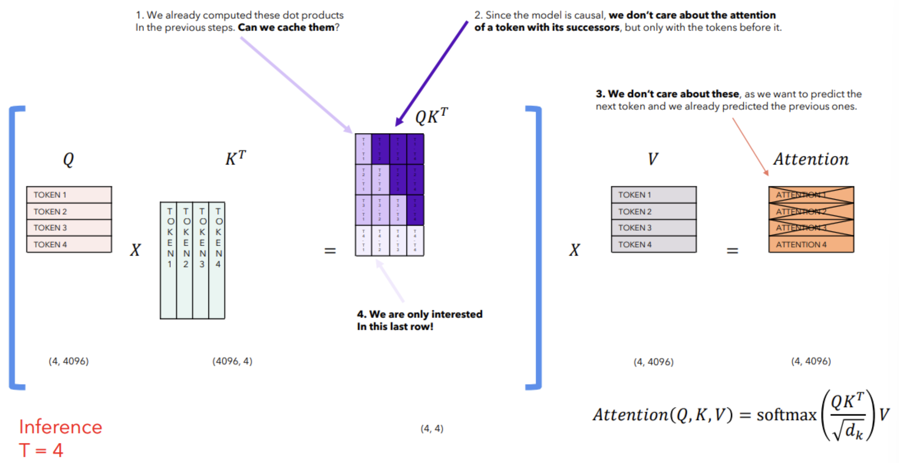

# Transformer Optimizations

## KV Cache
- Since tokens are simply appended to the output embedding each time step, only the last token is new

### $QK^T$ Cache
- The attention operation can be simplified to append to the $QK^T$, instead of reconstructing it from scratch

- Due to masking, the upper diagonal doesn't need to be computed; and, the lower diagonal is already computed
- So, only the bottom row needs to be computed for the new token

### $V$ Cache
- For the output matrix, only the last V token is new, so a similar strategy can be used

## Multi-Query Attention
- Instead of a single query, you can use multiple queries
- Each "head" is a different query, which allows the model to focus on different parts of the input
- However, K and V are still shared and contain the entire input

**Efficiency benefits**
- The KV cache size is reduced by a factor of (# of heads). This reduces the amount of memory needed to be stored in the GPU
