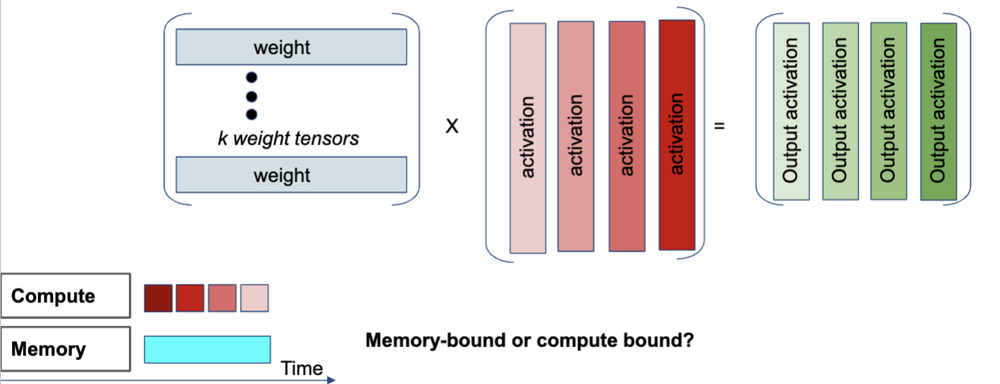

# Hardware Performance of DNNs
- Some operations are **memory-bound**, which means they are limited by the memory performance
- Others are **compute-bound**, which means they are limited by the compute performance

## Examples of computations
- **Convolution**: compute bound
    - Optimization: **depthwise convolution**: each channel is convolved separately, which reduces the number of computations
- **Linear** or **Fully Connected**: memory bound
    - The weights are stored in memory and read for each operation
    - Batching allows you to do multiple compute operations while the weights are already loaded in the GPU memory
        - Memory time stays the same, but you can get more computations out of that fixed time
    
    
- **Activation functions**: typically computationally inexpensive
- **Batchnorm**: slow during training, but fast during inference

