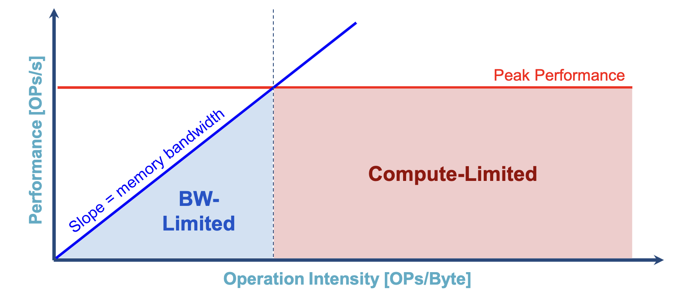
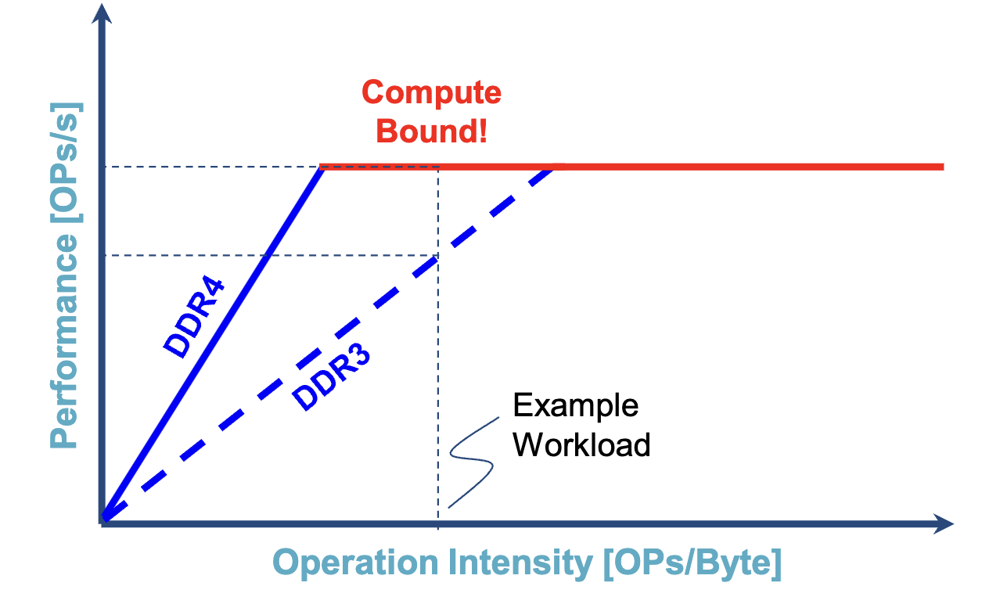
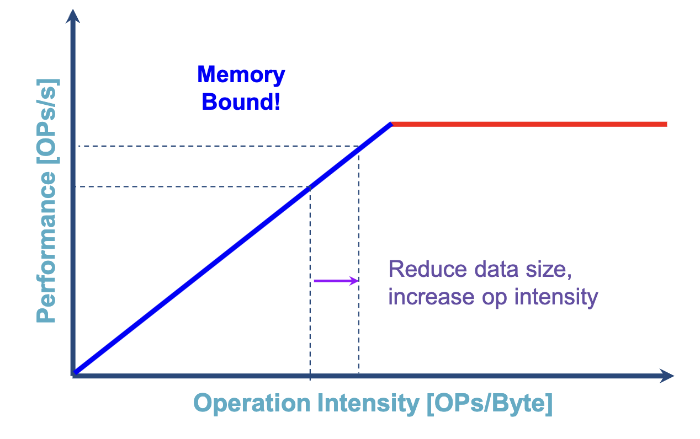
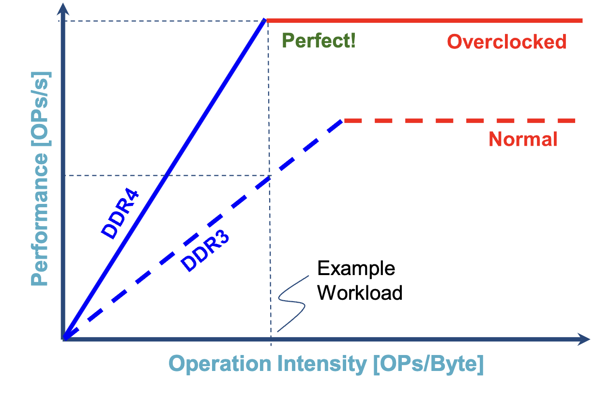

# Introduction to Hardware

## Generic CPU
- Caches
- Memory controller
- FPU (does floating point operations)
- Cores

Almost all of the computations in ML are run solely on the FPUs.

## Memory
- **Von Neumann Bottleneck**: the CPU is much faster than the time to load memory
- Buffer/on-chip memory/RAM vs external memory
- Caching

## Demands of ML
- Multiply and sum operations are the most important, as they are the most common

## Measuring Hardware
### Compute Metrics
- OPs: non-floating-point operations
- MACs: multiply-accumulate operations
- FLOPs: floating point operations
    - Chips are often labeled with "peak FLOPs/s"

$$
\frac{operations}{sec} = (\frac{1}{\frac{cycles}{operation}}\times\frac{cycles}{sec})\times\# PEs
$$

### Memory Metrics
- Memory capacity (GB)
- memory bandwidth (GB/s): transfer speed from memory chip to compute chip

### Roofline Plots
- Characterizes the performance of a hardware device across different workloads
- Both axes are log scale

## Optimizations
### Speeding up a memory-bound application
- Use a faster memory chip
    - Flattens out slope of roofline
    
- Use lower numerical precision to reduce operation intensity
    - 

### Speeding up a compute-bound application
- Overclocking can increase both compute and memory performance
- The intersection of the compute-bound and memory-bound lines should match the workload you want to use

## Real-world measured performance
- Measured performance is the actual performance of a given model on given hardware
- Measured performance can be limited by:
    - Memory access inefficiency (e.g. uncoalesced reads, causing cache misses)
    - Compute utilization (e.g. number of channels vs. number of cores)
    - Complex DNN topologies (e.g. control flow)
- DNN performance is measured in **throughput** and **latency**
    - Latency: seconds it takes for one inference
    - Throughput: inferences per second
