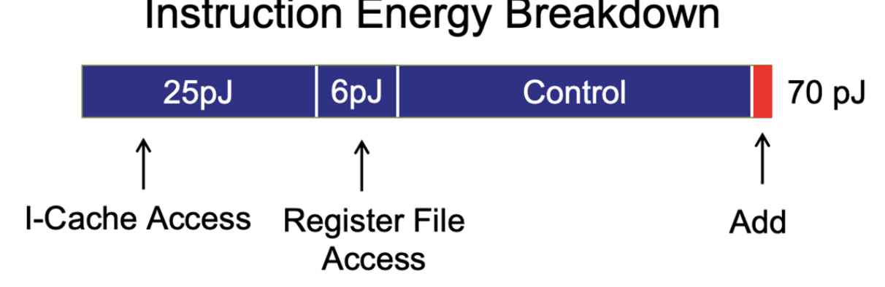
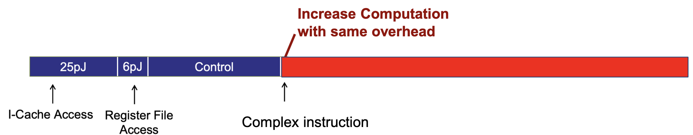
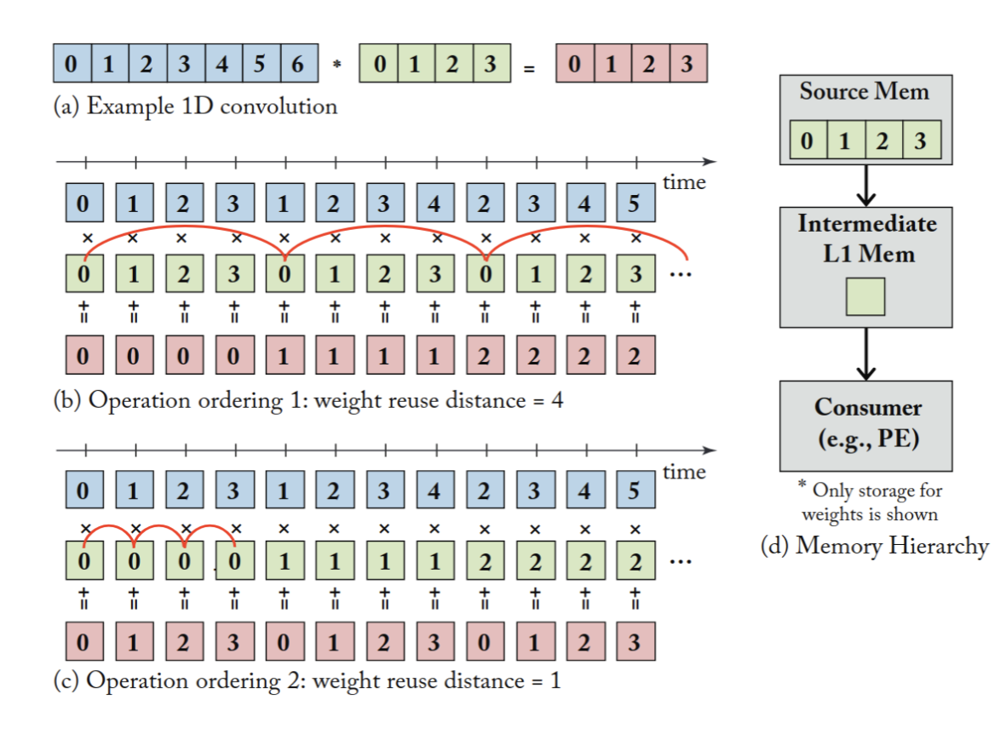
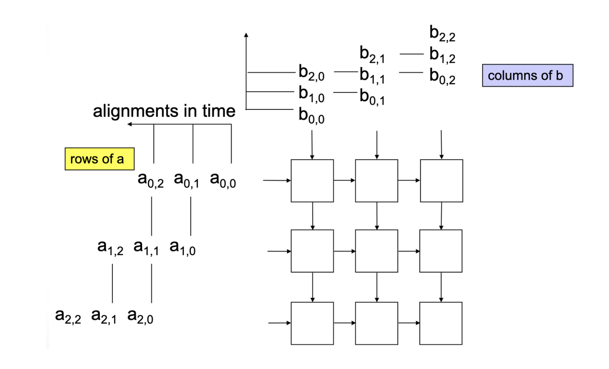
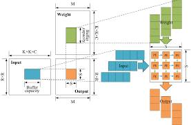
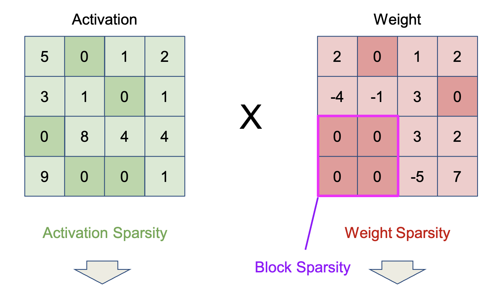
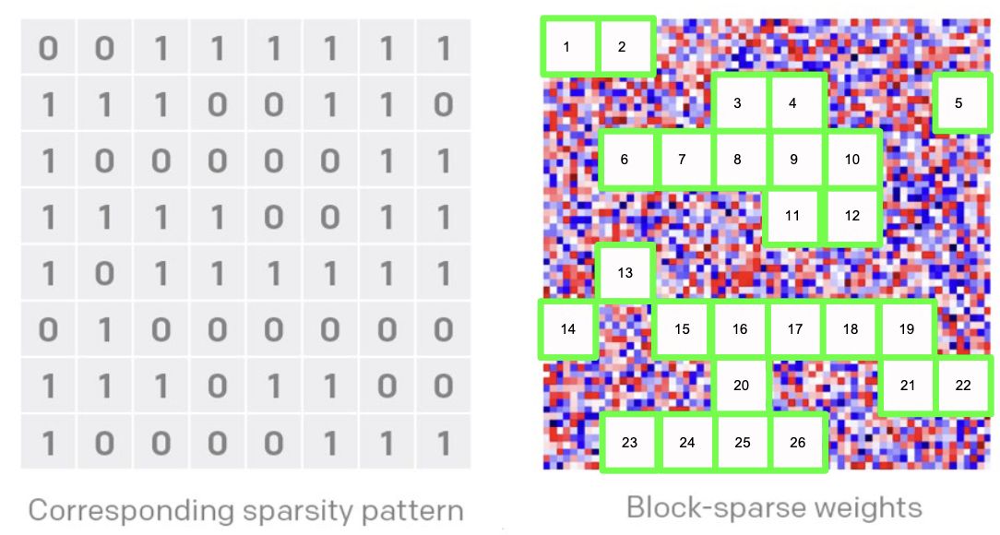
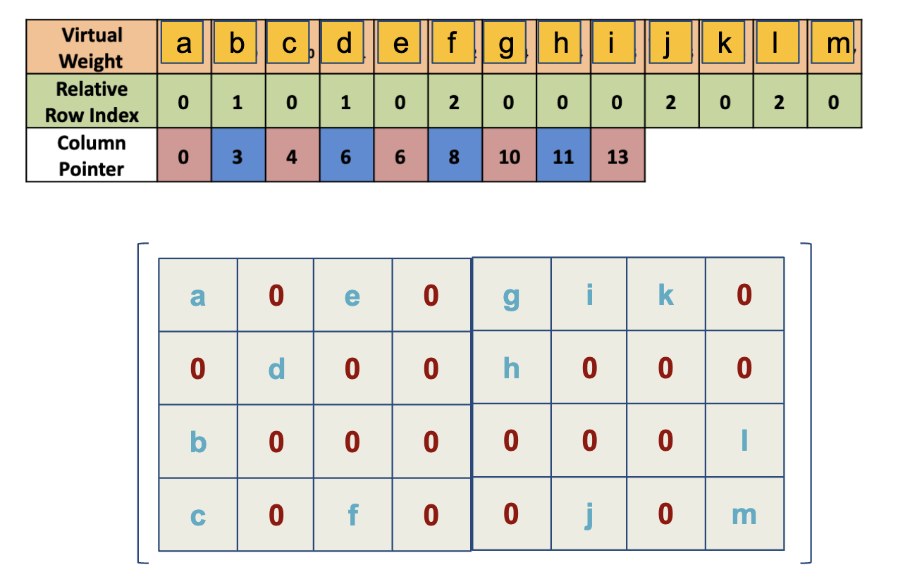

# Hardware Optimization

## Arithmetic Optimization
### Overhead
- Most of the energy on a single computation is spent on the overhead, e.g. cache access, register access, control

- You can amortize this overhead by performing more complex computations, to do more computation per overhead
    - Ex. do 16x16 matrix multiplication instead of a single multiply-add operation
- Specialized instructions are also able to parallelize operations like matrix multiplication

### Data Representation
- Different specifications of floating point values can be used to optimize FLOPs
    - e.g. number of bits, size of mantissa, size of exponent
#### Quantization
- There are efforts to quantize ML models to use ints instead of floats
- Quantization helps more with addition than multiplication operations
    - Using floats is 9x slower for add operations
    - Using floats is 1.2x slower for multiply operations
    - This is due to having to shift the exponent component for add operations

## Memory Optimization
### Locality
- You can move data closer to the computation

### Reuse
- Once data is close, you can perform multiple computations on it
- For example, map over weights rather than inputs to reuse weights while they're in the cache

### Weight Stationary vs Input Stationary
- Weight stationary: the same weights are reused, while the window of input slides
- Input stationary: the same input is reused, while the weights change

**Uses**
- Weight stationary is better for convolutions, since the weights are reused
- For fully connected layers, it depends on batch and layer size
    - Large batch size prefers input stationary
    - Small layer size prefers input stationary

## Parallel Architectures
- Systolic array pumps temporally-aligned data through a matrix of processing elements, like a heartbeat
- These are the "wedge"–shaped diagrams

## Sparsity
- If there are zero-values in the activations or weights (i.e. a sparse matrix), you can skip some computations
- Sparsity may be caused by sparse activation functions like ReLU

### Coarse-Grained Block Sparsity
- Block sparsity is when an entire block of weights is 0
- When you fetch weights, you can also fetch a **sparsity pattern**, which tells the hardware which weights to skip

### Fine-Grained Sparsity
- NVIDIA recently added fine-grained sparsity
- Up to 2 cells out of a block of 4 can be zero
- 12.5% memory overhead to store location of non-zero values

#### Compressed Sparse Column (CSC) Format

Ex.
$$
\left[0, 0, 1, 2, 0, 0, 0, 0, 0, 0, 0, 0, 0, 0, 0, 0, 0, 0, 0, 0, 0, 0, 3\right]\\
v = [1, 2, 0, 3]\\
z = [2, 0, 15, 2]
$$

- $v$ tells you the non-zero values
- $z$ tells you how many zeros are before each non-zero value
- The column pointer tells you how many elements are in each column before you switch to the next column

