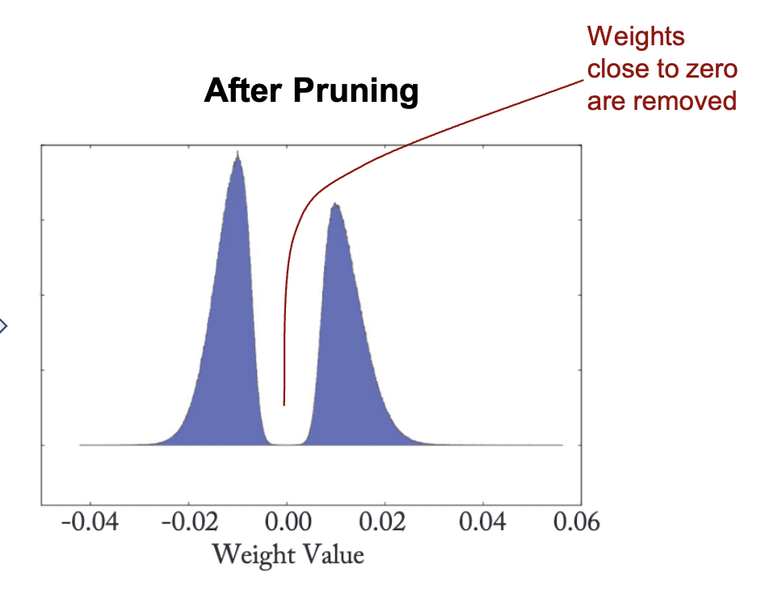
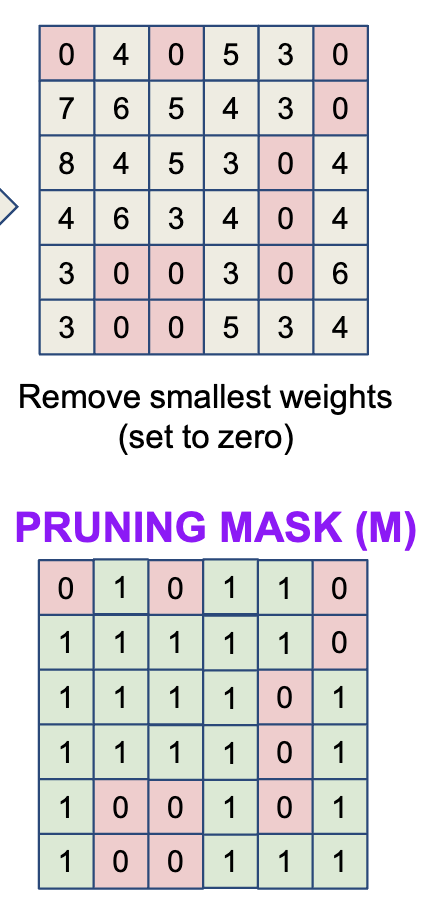
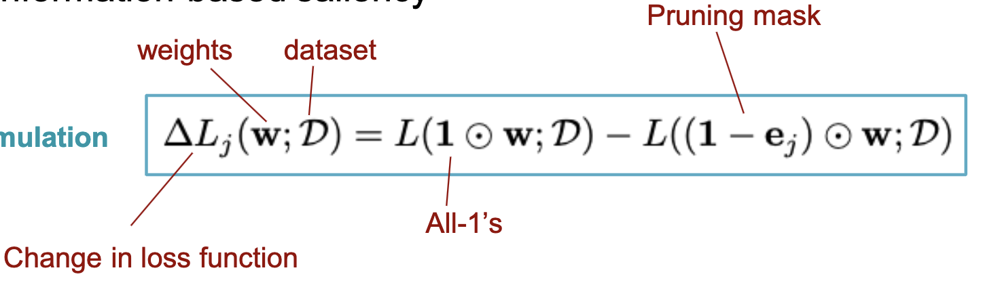
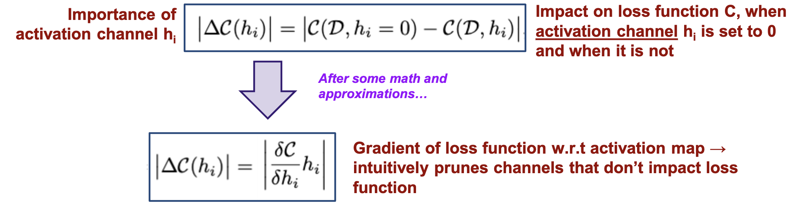
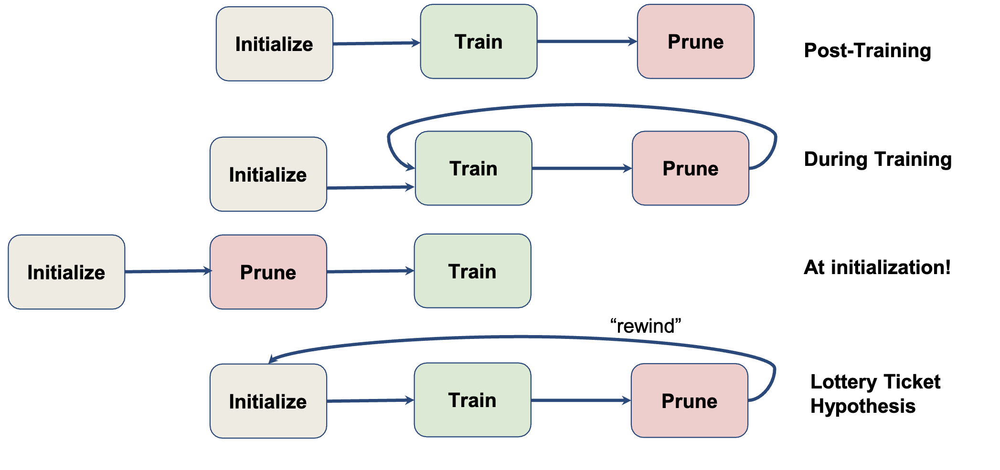

# Pruning
- You can remove the parameters with the smallest magnitudes from a model to increase performance
- Pruning encourages sparsity

### Metrics
- p%: pruning rate (% of parameters you remove)
- s%: sparsity ($100 - p\%$)
- Compression: $\frac{1}{s}$
### Pruning Mask
- You can use a pruning mask to keep track of which parameters are pruned

## How often to prune?

### Iterative Maginitude Pruning
- This method works the best in practice
1. Train a neural network
2. Remove p% of parameters with smallest magnitude
3. Fine-tune (retrain) the model
4. Goto 2

## What to prune?

### Local vs. Global pruning
- Local pruning: remove the least important p% weights in each layer
- Global pruning: rank the weights in the entire DNN and remove the least important p% weights
    - Global pruning usually works better

#### Layer Collapse
- Global pruning can lead to layer collapse (i.e. every parameter in a layer gets pruned)
- To avoid this, you can set a limit on # parameters in a layer that can be pruned

### Structured and Unstructured Pruning
- Unstructured pruning: remove individual weights
- Structured pruning: remove blocks of weights

## How to encourage sparse weights?
- If you use regularization, the model will be rewarded for pruning weights

## Pruning Criteria
- Though you can use magnitude to choose which weights to prune, there are also other ways

### Gradient-based pruning
- Calculate the loss with no parameters pruned
- For each parameter, its importance is the change in loss when that one parameter is removed

### Information-based pruning
- Mutual Information is a measure of how much information is present in one variable about another variable
- For each channel, its importance is the loss function when it's set to 0, minus the loss function when it's not set to zero

## When to prune?

