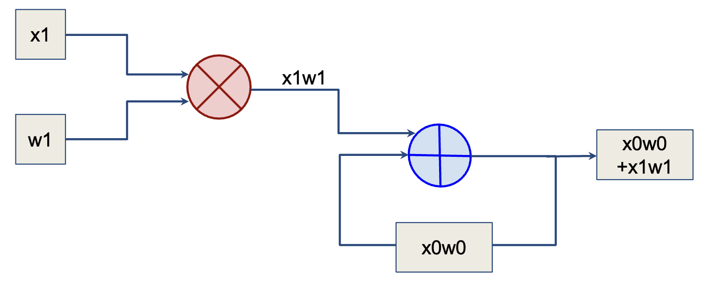
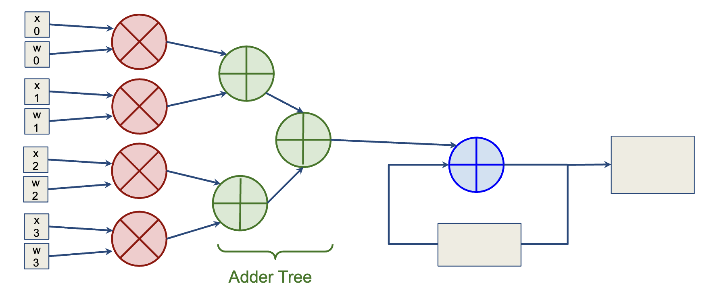
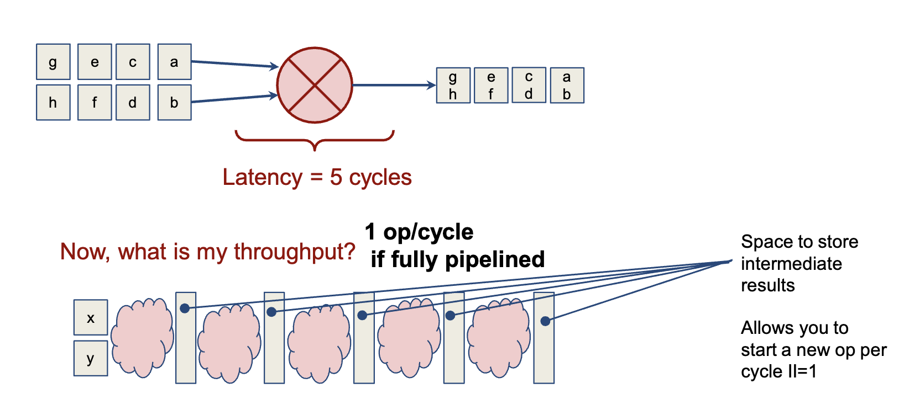
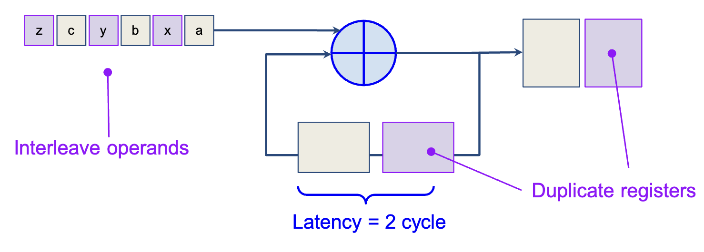
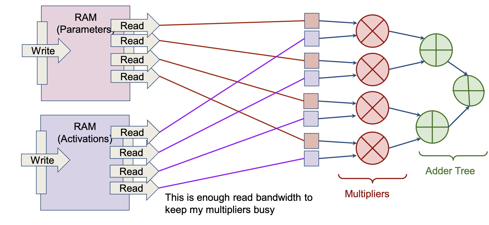

# Microarchitecture

## Processing Element Architecture

### Multiply/Accumulate

- Deep learning uses multipliers and accumulators
    - The accumulator adds numbers, but it also has a register to store the result so it can keep adding as inputs come in
    - The disclosed precision of a chip is the multiplier precision, i.e. an FP8 chip has 8-bit multipliers but 16-bit accumulators

### Adder Tree
- You can parallelize addition by using an adder tree
- For example, for 8 weights, you run the first 4 multipliers in parallel, add them through the tree, add it to accumulator; then run the next 4
- Tradeoff between speed and chip area

### Pipelining

**What is pipelining?**
- Pipelining is storing intermediate results in registers
- Each cycle, you only doa part of the full operation, and store the intermediater esult
- The next cycle, you do the next part of the operation, and so on
- This way, multiple inputs can be fed through the pipeline at the same time

**Metrics**
- Initiation interval: how often you can start the computation of a new element in a loop
- Throughput: # ops / cycle
- Initiation interval: how often you can enter a new element into the start of the pipeline

#### Interleaving
- Some operations, like accumulate, depend on the previous result
- Example: purple depend on previous purple, brown depend on previous brown
- You can use 2 registers and interleave purple and brown to reduce dependency

### Numerical Format
- You can use **block floating point**, where multiple data points share the same exponent
- This is useful for deep learning because the weights are often similar in magnitude

## On-Chip Memory
- Number of read/write ports: for parallel arithmetic operations, you need multiple read/write ports
- However, the more ports, the SRAM will be larger, slower, and take more power

## On-Sensor Compute
- You can compute on the sensor to reduce data movement
