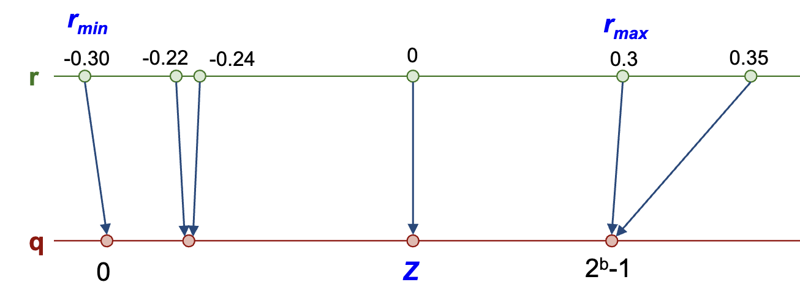
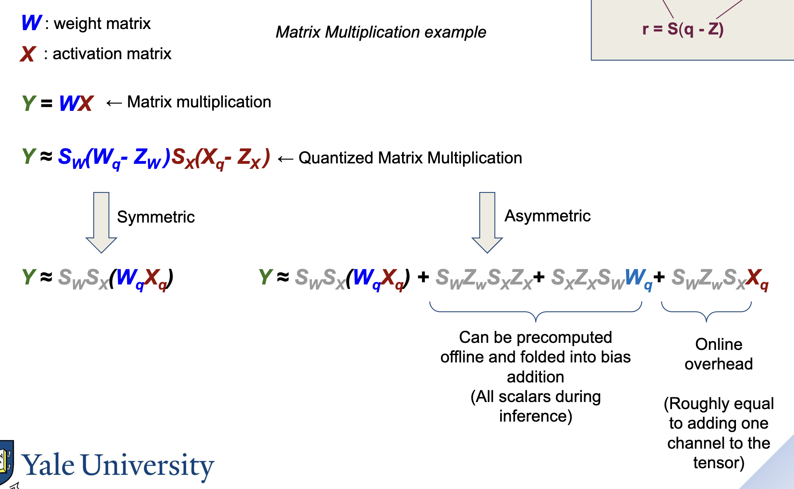
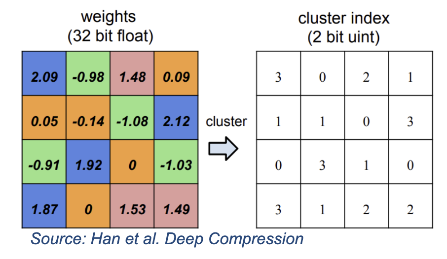

# Quantization
- Quantization is mapping the continuous input range to a discrete set of values.
- With quantization, you can use integer operations instead of floating point operations.
- Due to the normal distribution of weights, along with normalization and regularization, NNs are tolerant to reduction in precision.

## Formula
- $S = \frac{r_{max} - r_{min}}{2^b - 1}$
    - $r_{max}$: maximum value in the range
    - $r_{min}$: minimum value in the range
    - $b$: number of bits in the resulting integer
- $q = clip\left(round\left(\frac{r}{S}\right) + Z, 0, 2^b - 1\right)$
    - $r$: input value
    - $Z$: zero point (usually the midpoint between 0 and $2^b - 1$)
    - $clip(x, a, b)$: clips $x$ to the range $[a, b]$

- Dequantization formula: $r = S(q - Z)$

## Advantages of Quantization
- Quantization reduces the memory footprint of the model
- Quantization can defend against adversarial attacks, like adding structured noise to an input.

## Quantizing weights vs. activations
- If you quantize just weights, you get the memory advantage, but not the compute advantage
    - Since you are still doing floating point operations for activations
    - Thus, throughput does not increase during inference time
- If you quantize both weights and activations, you get the compute advantage as well

## Symmetric quantization
- When you multiply a quantized weight matrix (W) and a quantized activation matrix (Z), you get **online overhead** (overhead which can't be precomputed since it depends on input)

- You can use symmetric quantization (set the midpoint Z to zero) to eliminate the term with online overhead

## Finding scale factor and zero-point
- You can find the scale factor and zero-point by running minibatches of data through the DNN, and capturing $r_{max}$ and $r_{min}$

## Quantization-aware training
- You can simulate quantization during training to make the model more robust to quantization
- To simulate quantization, you run the quantization formula, then run the dequantization formula
- However, during backpropagation, you use **straight-through estimation** (no quantization) otherwise the "staircase" quantized function will zero out gradients

# Non-Linear Quantization
- You can represent weights by _cluster index_—each weight that is similar to each other is assigned the same index

- To de-quantize, you use a lookup table from cluster index to approximate value
- Storage is drastically decreased since you only need to store the cluster index and the lookup table
