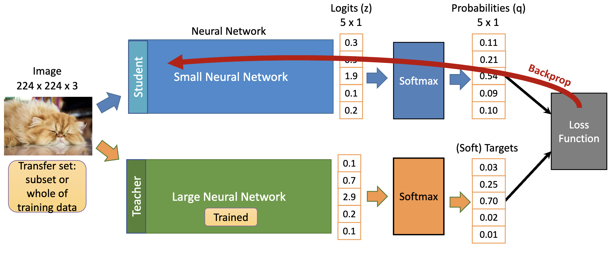
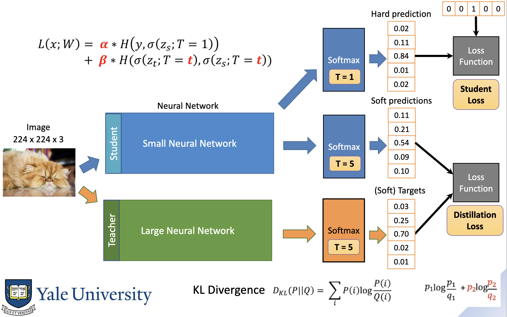

# Knowledge Distillation
- Usually with a classifier model, we use one-hot training data
    - These "hard targets" have no information about wrong classes
- You can instead use "soft targets," where close—but not correct—classes have a small probability

> Ex. Correct class: Lion
> Class | Value
> | -- | -- |
> | Car | 0 |
> | Lion | 0.7 |
> | Cheetah | 0.3 |
> | Bicycle | 0 |

## Generating soft targets

- To obtain these soft targets, you can run a pre-trained large model, and use its softmax output as your training data

- You can add a temperature to soft targets, which makes the distribution more evenly distributed and less pointy
- Softmax with temperature: $q_i = \frac{e^{z_i/T}}{\sum_j e^{z_j/T}}$

## Loss Function
- Student loss is calculated based on the non-temperature softmax
- Distillation loss is based on the difference between the temperature softmax of the student and teacher

## Ensembles
- You can take the average output of multiple teacher models

## Offline vs. Online
- Offline training: pretrained teacher used to add distillation loss during student training
- Online training: both teacher and student model are trained simultaneously
- Self-distillation: student model's early checkpoints are used as teachers
