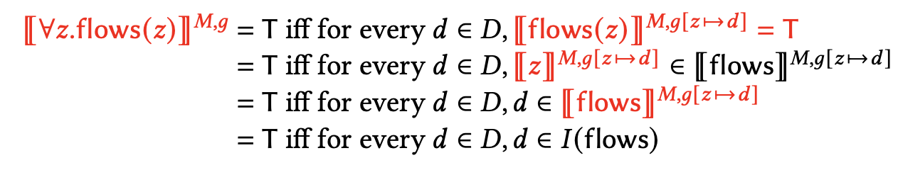

# First Order Logic
- **First-order predicate logic** deals with quantified statements, using quantifiers
    - $\forall$: "for all"
    - $\exists$: "there exists"

> Ex.
> - "Something stinks": $\exists x.\text{ stinks}(x)$
> - "Nothing stinks": $\neg\exists x.\text{ stinks}(x)$
> - "Mary saw every cat": $\forall x.\text{ cat}(x)\implies\text{ saw}(m, x)$

> Ex. ambiguous sentence: "a doctor examined every patient"
> - $\exists x.\text{ doctor}(x)\implies\forall y.\text{ patient}(y)\implies\text{ examined}(x, y)$
> - $\forall y.\text{ patient}(y)\implies\exists x.\text{ doctor}(x)\implies\text{ examined}(x, y)$

Usually, the implication $\implies$ is used with $\forall$, and $\land$ is used with $\exists$.

> Bad examples:
> - $\forall x.cat(x) \land saw(mary, x)$ "Everything in the universe is a cat, and mary saw it"
> - $\exists x.cat(x) \implies saw(mary, x)$ "There is something in the universe. If this one specific thing is a cat, mary saw it"

## Assignment of Variables
- Interpretations are given by a model and a map of variable assignments
- $[[u]]^{M,g} = g(u)$

> Ex.
> $$
> g_0 := \left[ \begin{array}{c} x \rightarrow \text{Didi} \\ y \rightarrow \text{Junebug} \\ z \rightarrow \text{Simon} \\ v \rightarrow \text{Junebug} \\ \dots \end{array} \right]
> $$
> $$
> I_0 := \left[ \begin{array}{c} \text{s} \rightarrow \text{Simon} \\ \text{d} \rightarrow \text{Didi} \\ \text{j} \rightarrow \text{Junebug} \\ \text{human} \rightarrow \{\text{Simon}\} \\ \text{cat} \rightarrow \{\text{Didi}, \text{Junebug}\} \\ \text{loves} \rightarrow \{(\text{Simon}, \text{Didi}), (\text{Simon}, \text{Junebug})\} \\ \text{humanOf} \rightarrow \{(\text{Didi}, \text{Simon}), (\text{Junebug}, \text{Simon})\} \end{array} \right]
> $$
> $$
> [[ \text{human}(x) ]]^{M_0, g_0} = F
> $$

## Calculations of Meanings

- $\exists$ maps to "for some $d \in D$"
- $\forall$ maps to "for all $d \in D$"

> Ex.
> 

## Calculation Cheat Sheet

**Non-logical constants (predicate/function symbols, individual constants):**
*  $[[\alpha]]^{M, g} = I(\alpha)$

**Predication formulas:**
* i.e. `human`
*  $[[\pi(\alpha_1, ..., \alpha_n)]]^{M, g} = T$ iff $\langle[[\alpha_1]]^{M, g}, ..., [[\alpha_n]]^{M, g}\rangle \in [\pi]^{M, g}$

**Complex terms/functionals:**
* i.e. `motherOf`
*  $[[\gamma(\alpha_1, ..., \alpha_n)]]^{M, g} = [\gamma]^{M, g}(\langle[[\alpha_1]]^{M, g}, ..., [[\alpha_n]]^{M, g}\rangle)$

**Variables:**
*  $[[u]]^{M, g} = g(u)$

**Compound formulas (with connectives):**
*  Not: $[[\lnot \phi]]^{M, g} = T$ iff $[[\phi]]^{M, g} = F$
*  And: $[[\phi \land \psi]]^{M, g} = T$ iff $[[\phi]]^{M, g} = T$ and $[[\psi]]^{M, g} = T$
*  Or: $[[\phi \lor \psi]]^{M, g} = T$ iff $[[\phi]]^{M, g} = T$ or $[[\psi]]^{M, g} = T$
*  Implication: $[[\phi \to \psi]]^{M, g} = T$ iff $[[\phi]]^{M, g} = F$ or $[[\psi]]^{M, g} = T$

**Quantificational formulas:**
*  $[[\exists u. \phi]]^{M, g} = T$ iff for some $d \in D$, $[[\phi]]^{M, g[u \to d]} = T$
*  $[[\forall u. \phi]]^{M, g} = T$ iff for every $d \in D$, $[[\phi]]^{M, g[u \to d]} = T$