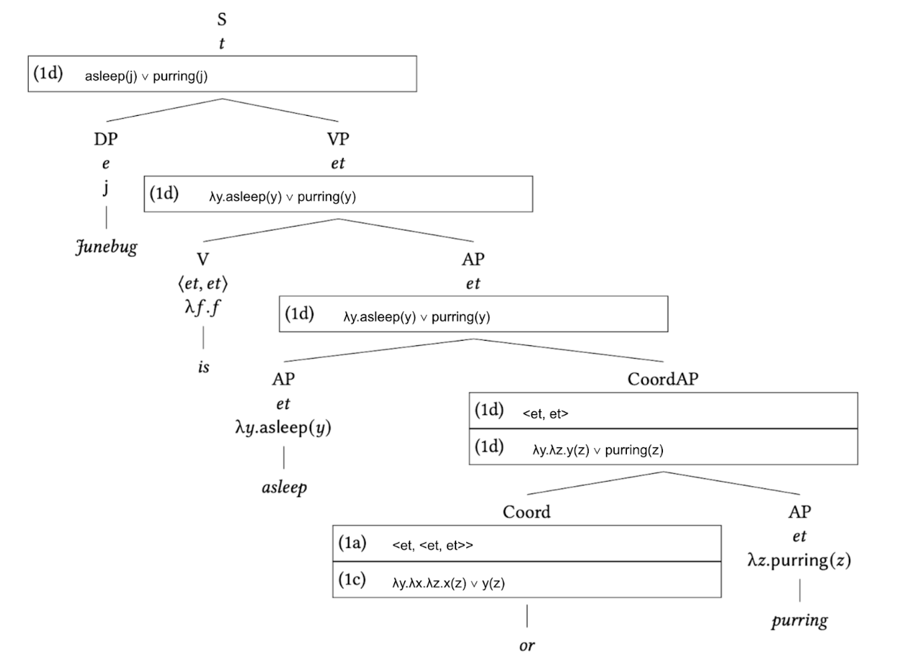
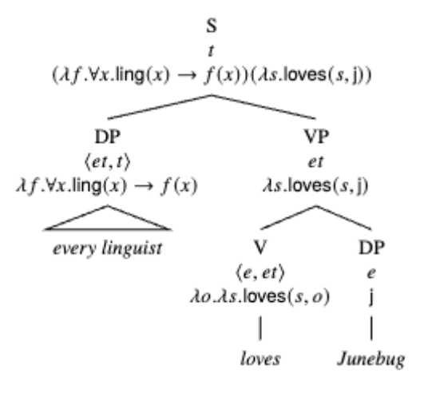

# Interpreting Natural Language
- You can use various function application rules to interpret syntax trees.

## Rules

### Function application
If $\gamma$ is a node whose children are $\alpha$, $\beta$, where
- $\alpha \rightsquigarrow \alpha' : \langle \sigma, \tau \rangle$
- $\beta \rightsquigarrow \beta' : \sigma$
then $\gamma \rightsquigarrow \alpha'(\beta') : \tau$

### Non-branching nodes
- If $\beta$ is a node with a single daughter $\alpha$, and $\alpha \rightsquigarrow \alpha'$, then $\beta \rightsquigarrow \alpha'$.

## Common parts of speech and their types

> Note: `et` is shorthand for `<e, t>`

- Noun: `e`
- Adjective: `et` (ex. `λx.red(x)`)
- Transitive verb: `<e, et>` (ex. `λx.λy.licked(y, x)`)
- Linking verb: `<et, et>` (`λf.λf`, i.e. the identity function)
- "and": `<et, <et, et>>` (`λy.λx.λz.x(z) ∧ y(z)`)
- "or": `<et, <et, et>>` (`λy.λx.λz.x(z) ∨ y(z)`)

### Quantifiers
- "a": `<et, <et, t>>` (`λg.λf.∃x.g(x) ∧ f(x)`)
    - ex. `g = linguist`,`f = smokes` (a linguist smokes)
- "every": `<et, <et, t>>` (ex. `λg.λf.∀x.g(x) → f(x)`)
    - ex. `g = linguist`,`f = smokes` (every linguist smokes)

