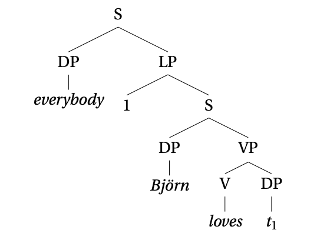
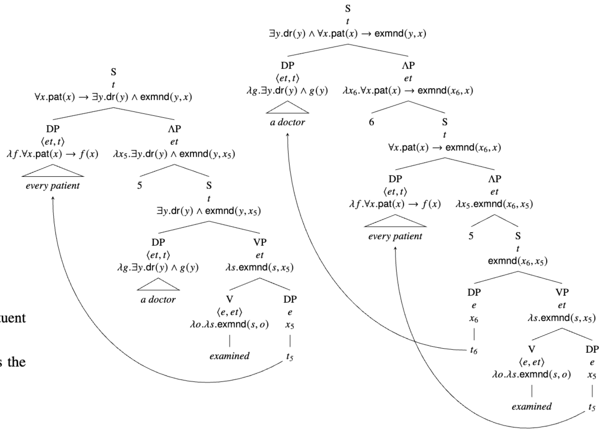
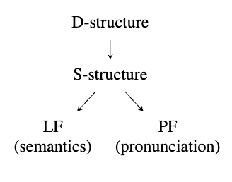
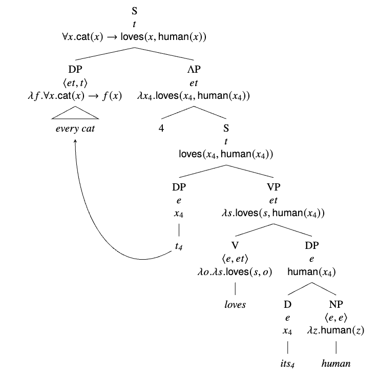

# Quantifier Movement

## Definitions
- Overt movement: movement that you can hear in a sentence (e.g. moving the object in a question)
- Covert movement: movement you can't hear in a sentence (e.g. quantifier raising)
- Trace: a remnant of the moved element that's left in its original position

## Quantifier Raising
- We need a new way to interpret quantifiers in object positions (e.g. "a cat saw every mouse")
- We can allow quantifiers to move up (quantifier raising, QR)

> 
> 
> Two interpretations of _a doctor examined every patient_

- This naturally leads to scope ambiguity with sentences with multiple quantifiers, since we can choose to move each quantifier or not

## The Y Model

- Overt movement happens between D and S structure
- Covert structure happens between S structure and LF

## Pronoun Binding
- Quantifier raising allows pronoun binding, as in "every cat loves **its** human"

