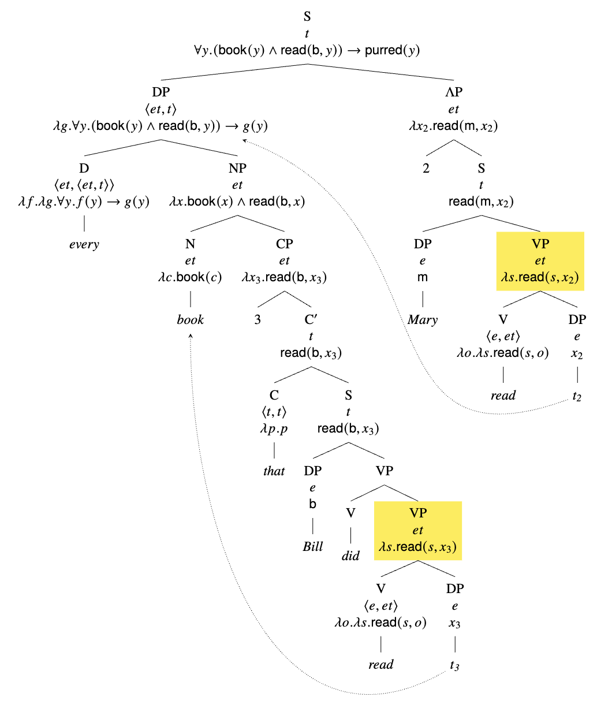

# Ellipsis
- Ellipsis is when words can be omitted and meaning can still be inferred.

> Ex. "Mary saw an elk with binoculars and John did too."

- There is ambiguity within the first clause, but the elided clause is understood to have the same interpretation of the first clause.

## Strict/Sloppy Ambiguity
- In some cases, the elided clause can have a different interpretation than the first clause.

> Ex. "John likes his mom and Bill does too."

## Antecedent-Contained Deletion
- Sometimes, an elided clause can seemingly refer to itself.

> Ex. Mary read every book that Bill did
> - Elided VP: "read every book that Bill did"
> - Δ = [VP read every book that Bill did Δ]

- Instead, we can quantifier-raise the object and make both VPs the same.

> Ex.
> - Δ = [VP read _t_]
> - For Mary, _t_ = "every book that Bill did"
> - For Bill, _t_ = "book"

