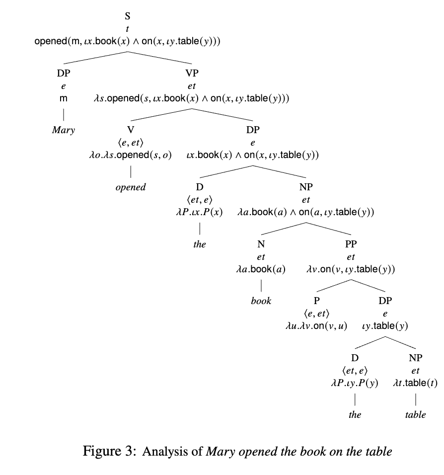

# Presupposition
- Presuppositions are definedness conditions—when a presupposition fails, the value of its sentence is undefined.
- When a presupposition fails, the truth value is `#`—a failure to define any meaning

## Tests for presupposition
- You can use _non-veridical_ contexts, which destroy normal entailments, to test if something is a presupposition
    - Conditionals: "If mom regrets voting for Reagan, she’ll vote for Harris"
    - Modals: "Mom might regret voting for Reagan"
    - Polar questions: "Does mom regret voting for Reagan?"

## Definites
- Definites are created when using articles like `the`
- They create presuppositions that there is only one of that thing
- We can use iota definitions, requiring that there is **one and only one** entity satisfying $\phi$

$$
[[ \iota u.\phi]]^{M,g} = \begin{cases}
    d  \text{ if } \{ d'\in D_e : [[\phi]]^{M,g[u\mapsto d']}\} = \{d\}\\
    \# \text{ otherwise}
\end{cases}
$$

- You can use this in constructions:
    - `opened(m, 𝜄𝑥.book(𝑥) ∧ on(𝑥, 𝜄𝑦.table(𝑦)))`

## Presupposition Meanings
- We define a new character for presuppositions: $\partial$
$$
[\![ \partial(\phi) ]]^{M,g} = \left\{
\begin{array}{ll}
      \top & \text{if } [\![ \phi ]]^{M,g} = \top \\
      \# & \text{otherwise}
\end{array} 
\right.
$$

- For example, `every` presupposes there's at least one thing in the domain
    - `every { 𝜆𝑃.𝜆 𝑓 .𝜕 (∃𝑥.𝑃(𝑥)) ∧ ∀𝑥.𝑃(𝑥) → 𝑓 (𝑥) : ⟨𝑒𝑡, ⟨𝑒𝑡, 𝑡⟩⟩`

## The `A` Operator
- Sometimes, we need to "massage" the `#` value to `F`
- For example, "The King of France exists" is false if the presupposition fails
- We define the `A` operator as mapping `#` to `F`:

$$
[\![ A(\phi) ]]^{M,g} = \left\{
\begin{array}{ll}
      T & \text{if } [\![ \phi ]]^{M,g} = T \\
      F & \text{if } [\![ \phi ]]^{M,g} = F \\
      F & \text{if } [\![ \phi ]]^{M,g} = \#
\end{array} 
\right.
$$

- Then, we can revise our definition of `exists` to:
    - `exist { 𝜆𝑥.∃𝑦.A(𝑦 = 𝑥) : 𝑒𝑡`