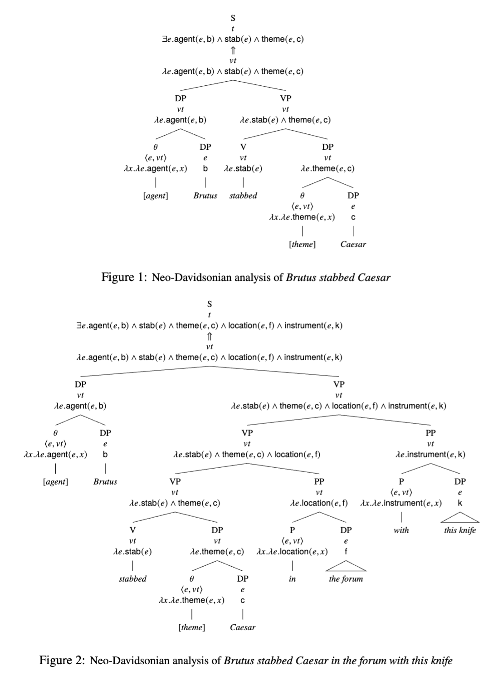

# Events
- We already have a framework for predicate modification
- Verbal modification follows a similar entailment property:
    - `I've got a new black car` entails `I've got a car`, `I've got a new car`, `I've got a black car`
    - `Brutus stabbed Caesar in the forum with this knife` entails `Brutus stabbed Caesar in the forum`, `Brutus stabbed Caesar with this knife`, `Brutus stabbed Caesar`
- We can model this by defining functions `location: vt`, `instrument: vt`
    - These take an event object, their object, and return a truth value
- To account for this, we can modify our "predicate modification" rule to take a Generic type

> If $\gamma$ has children $\alpha \rightsquigarrow \alpha': \langle \tau, t \rangle$ and $\beta \rightsquigarrow \beta': \langle \tau, t \rangle$, then
> - $\gamma \rightsquigarrow \lambda x.\alpha'(x) \land \beta'(x) : \langle \tau, t \rangle$

- We also assume predicates of type `vt` are "extistentially closed"

> If $\alpha \rightsquigarrow \alpha' : vt$, then $\alpha \rightsquigarrow \exists e.\alpha'(e) : \langle t \rangle$

- This gives us:
    - _Brutus stabbed Caesar in the forum with this knife_
    - `∃𝑒.stabbed(b, c, 𝑒) ∧ location(𝑒, f) ∧ instrument(𝑒, k) `

## Neo-Davidsonian Event Semantics
- With our event system, we think of verbs as functions of events
    - $saw \rightsquigarrow \lambda e.saw(e)$
- We now need **thematic roles** to account for arguments (subject, object)
    - `[agent] { 𝜆𝑥.𝜆𝑒.agent(𝑒, 𝑥)`
    - `[theme] { 𝜆𝑥.𝜆𝑒.theme(𝑒, 𝑥)`

